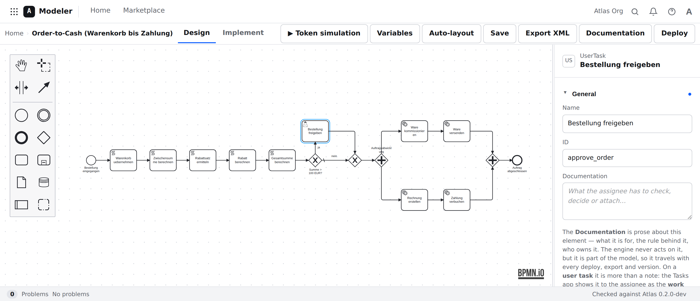
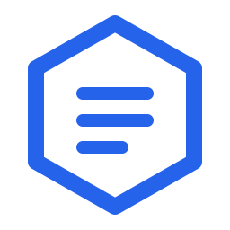
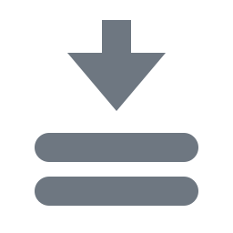
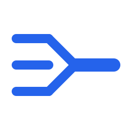
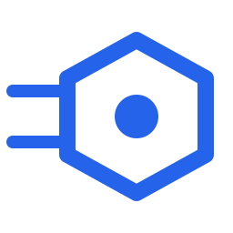
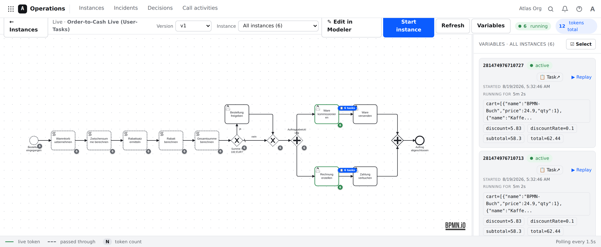
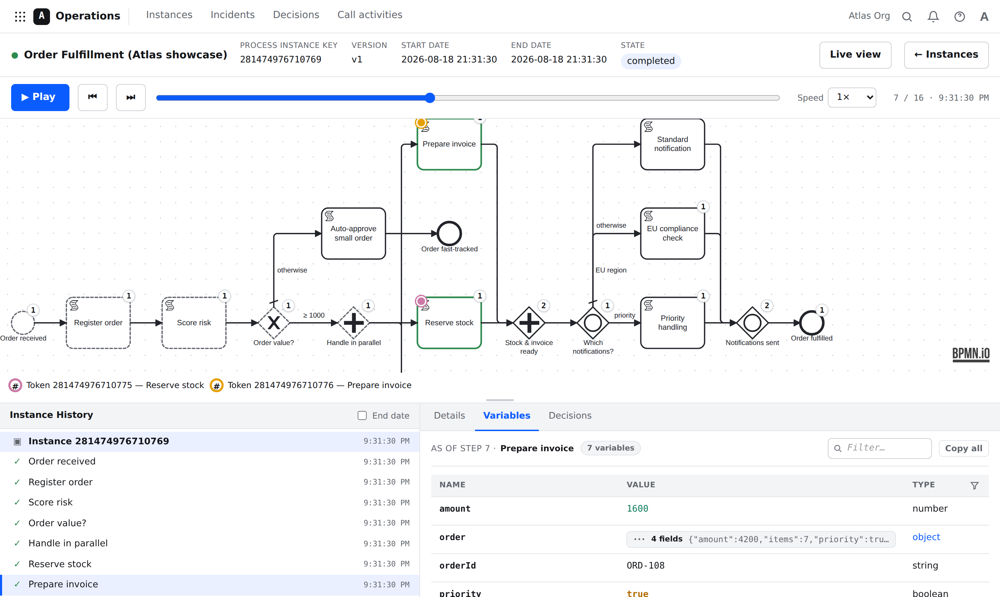
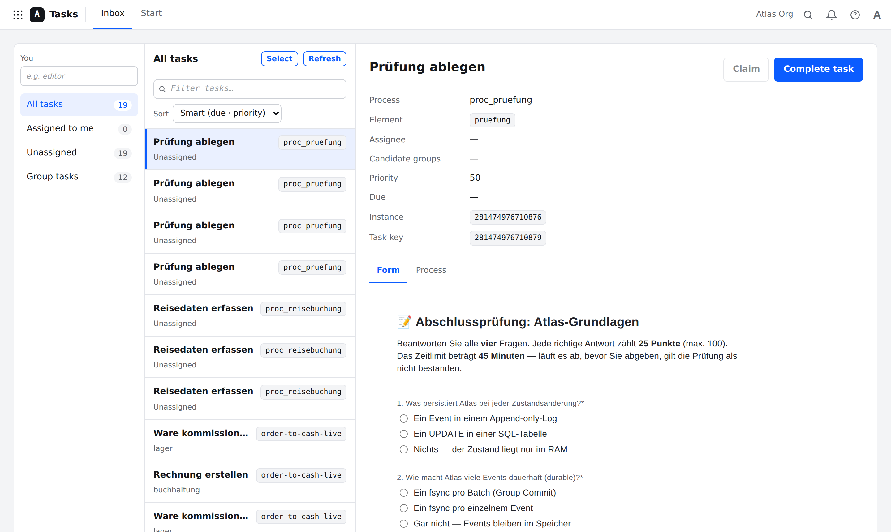
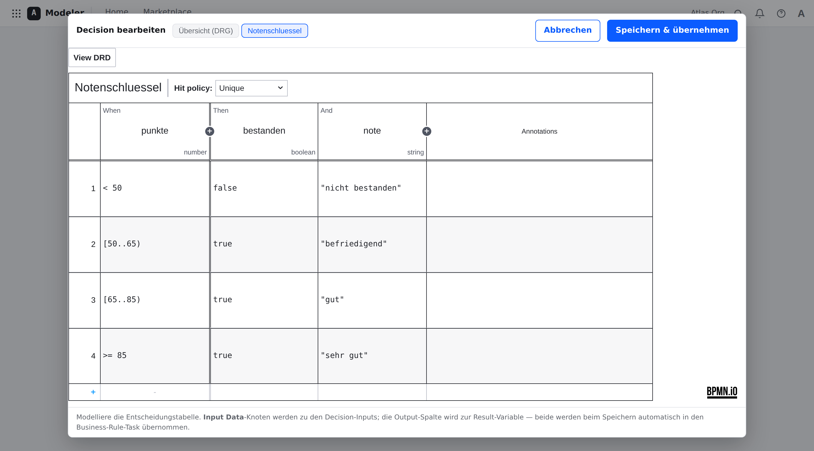

<div align="center">


# Atlas

**A durable, high-throughput BPMN 2.x workflow engine in a single Go binary.**

Design processes in the browser, run them on an event-sourced engine, watch every token live,
and replay any instance step by step — with no database, no message broker, and no runtime dependencies.

[](https://github.com/pblumer/atlas/actions/workflows/ci.yml)
[](https://github.com/pblumer/atlas/releases)
[](go.mod)
[](LICENSE)

**[atlas.blumer.cloud](https://atlas.blumer.cloud)**

</div>



**Atlas** is named after the Titan who bears an immense load without ever letting it drop. That's exactly what it does: it carries process instances, batch after batch, and never drops a token.

> **Developer preview (`0.x`).** Atlas already runs a broad slice of BPMN 2.x durably on a single node, but it is not ready for production use — the pre-1.0 API and on-disk formats are unstable and changing fast. See the [changelog](CHANGELOG.md) for what's in each release and the [roadmap](ROADMAP.md) for what's next.

---

## Install

Atlas is a single self-contained binary — engine, HTTP API, and the whole web UI in one file. Grab it from the [releases](https://github.com/pblumer/atlas/releases), verify it against `SHA256SUMS`, and run it:

```bash
tar -xzf atlas_0.1.0_linux_amd64.tar.gz
./atlas_0.1.0_linux_amd64/atlas serve --data-dir ./atlas-data
# open http://127.0.0.1:8080/
```

That's the whole setup. No SQL schema to migrate, no broker to provision, no sidecar.

**[Installation guide](docs/install.md)** — the step-by-step version: Linux with a systemd unit, Windows Server, macOS, turning on authentication, TLS, backups, upgrades, and the full flag and environment-variable reference. For containers and Kubernetes see **[Deploying Atlas](deploy/)**.

## Highlights

-  **One binary.** Engine, REST API, OpenAPI explorer, Modeler, Operations, Tasks app and MCP adapter ship in one file. Pure Go, no CGO, embedded state store.
-  **Durable by construction.** Every state transition is an append-only event. Nothing becomes visible before it is on disk, and crash recovery is a replay of the log.
-  **Compiled, not interpreted.** BPMN is compiled once at deploy time into a flat, integer-indexed graph — no XML parsing or string lookups on the hot path.
-  **Model in the browser.** A full BPMN modeler with a properties panel, problems panel, auto-layout, version history, live collaborative editing, and a token simulation you can play without deploying.
-  **See every token.** A live view of all running instances on the diagram, plus a step-by-step replay of any single instance with per-step variable snapshots.
-  **Human work included.** User tasks with real forms, claim/assign, candidate groups, and public start links — a Tasks app, not just an API.
-  **Decisions as tables.** DMN business rule tasks with an embedded decision-table editor, and every evaluation recorded with its inputs, outputs and rule trace.
-  **Made for AI agents.** `atlas mcp` exposes 65 Model Context Protocol tools, so an agent can author, deploy, run and inspect processes over the same API you do.

## Take the tour

### Design it

*(The screenshot at the top of this page.)* The Modeler is the standard [`bpmn-js`](https://bpmn.io) toolkit embedded in the binary ([ADR-0011](docs/adr/0011-single-binary-distribution-and-web-ui.md)) with a full properties panel ([ADR-0025](docs/adr/0025-full-properties-panel.md)), a versioned validation ("Problems") panel that checks the model against the engine that will actually run it ([ADR-0026](docs/adr/0026-problems-panel-and-versioned-validation.md)), server-side auto-layout ([ADR-0124](docs/adr/0124-server-side-diagram-auto-layout.md)), diagram version history ([ADR-0031](docs/adr/0031-diagram-version-history.md)) and live collaborative sessions ([ADR-0140](docs/adr/0140-live-collaborative-modeling-sessions.md)). **Deploy & run** takes a model from the canvas to a running instance in one click, and a browser-side token simulation ([ADR-0030](docs/adr/0030-play-mode-simulation.md)) lets you play a model through before it is deployed at all.

### Run it, and watch it



The Operations live view puts every instance of a process version on one diagram at once: green marks a live token, dashed marks a path already taken, and the badge on each element counts the tokens sitting there. The panel on the right lists each instance with its variables, and links straight to the waiting task.

### Replay any instance, step by step



Because state is a fold over an event log, an instance can be walked one step at a time after the fact ([ADR-0046](docs/adr/0046-single-process-step-replay.md), [ADR-0065](docs/adr/0065-multi-token-process-replay.md)). Scrub the timeline and the tokens move on the diagram; the **Variables** tab shows the values *as of that step* ([ADR-0048](docs/adr/0048-per-step-variable-snapshots.md)), and the **Decisions** tab shows which DMN rules fired. This is the answer to "why did this instance do that?" — not a guess reconstructed from logs, but the recorded facts.

### Give people real work



User tasks carry forms built in the browser ([ADR-0028](docs/adr/0028-forms-and-the-tasks-app.md)), with the modeler's documentation shown to the assignee as the work instruction. Tasks can be claimed, assigned to a person or a candidate group ([ADR-0042](docs/adr/0042-user-task-assignment-and-claim.md), [ADR-0045](docs/adr/0045-user-task-assignment-bound-to-identity.md)), scheduled with a due date and priority ([ADR-0091](docs/adr/0091-user-task-scheduling.md)), and started from a public link by someone with no account at all ([ADR-0029](docs/adr/0029-public-process-start-links.md)).

### Keep the rules where the business can reach them



Business rule tasks evaluate DMN decisions ([ADR-0014](docs/adr/0014-dmn-business-rule-tasks-via-temis.md)), authored in an embedded DMN editor ([ADR-0062](docs/adr/0062-embedded-dmn-editor.md)). Grading thresholds, approval limits and routing rules live in a table a domain expert can change — no redeploy of the process, and every evaluation is recorded with its inputs, outputs and the rule that hit ([ADR-0066](docs/adr/0066-decision-evaluation-records.md)).

## Why another workflow engine?

Most BPMN engines spend their time interpreting XML at runtime and writing process state to a SQL database one transaction at a time. Both are throughput killers. Atlas takes a different path, borrowed from the design lineage of log-structured, event-sourced systems:

- **Compile, don't interpret.** BPMN models are compiled once at deploy time into a flat, integer-indexed execution graph. At runtime there are no string lookups, no XML parsing, no map access on the hot path — just pointer arithmetic over cache-friendly slices.
- **Event sourcing over state mutation.** State is never written in place. Every state transition is an append-only event in a write-ahead log. The live state is a materialization of that log, kept in an embedded key-value store.
- **Group commit.** Many events are made durable with a *single* `fsync`. One fsync per event caps you at a few thousand per second; one fsync per thousand events lifts that ceiling by orders of magnitude.
- **Single writer per partition.** Each partition is driven by one goroutine processing commands sequentially — no locks, no mutex contention, cache-friendly state access, and trivially deterministic recovery via log replay. Scale horizontally by adding partitions, not threads.

Numbers, not adjectives: the [benchmark harness](benchmarks/) and its [published baseline](benchmarks/results/) measure throughput, latency distribution and recovery on a named machine at a named commit — including how much of the durable path is simply disk `fsync`.

## Design at a glance

```
Command → [Single-writer Processor] → State mutation (in-memory tx) + Events
                                              │
                                    Batched WAL append + one fsync
                                              │
                                    State commit → followup commands → side effects
                                              │
                                    (Recovery: replay events → state)
```

The three core pillars:

1. **The graph compiler** turns hierarchical BPMN XML into immutable, integer-indexed slices — nodes, flows, and scopes — with interned strings and pre-compiled expressions. Expensive once, cheap a million times.
2. **The processor** moves tokens through that graph as a deterministic fold over an event log. A single batch loop collects commands, processes them purely in-memory against a transaction, makes the whole batch durable with one fsync, then runs visible side effects.
3. **The data model** makes every step a keyed record with a `(ValueType, Intent)` discriminator. The same `applyToState` function runs live and during recovery, so the log and the state can never diverge.

## What it runs

**BPMN 2.x.** All four gateway kinds (exclusive, parallel, inclusive, event-based). Embedded, event, transaction, ad-hoc and call-activity subprocesses. Boundary events — timer, message, signal, error, escalation, conditional, compensation — interrupting and non-interrupting. Start events from none, message, timer and signal triggers. Multi-instance (parallel and sequential) and standard-loop activities. Link, escalation and terminate events. Data objects with input/output associations, lanes, collaborations with pools and message flows, and compensation.

Coverage is a **checkable claim, not a vibe**: the [conformance suite](conformance/) registers every execution feature against the recognized [workflow control-flow patterns](http://www.workflowpatterns.com/) and reports the gaps in [`COVERAGE.md`](conformance/COVERAGE.md) — currently 31 features and 9 patterns, with none uncovered. Five independent oracles back it, including replay equivalence on every model and an opt-in [differential test](conformance/differential/) against a second, unrelated engine.

**FEEL everywhere.** Gateway conditions, script tasks, timer schedules, multi-instance cardinality and completion conditions, and I/O mappings are compiled at deploy time and evaluated in-engine ([ADR-0008](docs/adr/0008-feel-expression-strategy.md), [ADR-0015](docs/adr/0015-reuse-feel-engine.md)).

**Work that leaves the engine.** Job workers over the HTTP API, polyglot script tasks (JavaScript, Python, PowerShell) run by shelling out to the interpreter ([ADR-0047](docs/adr/0047-polyglot-script-tasks-via-job-workers.md)), a service-task connector catalog ([ADR-0067](docs/adr/0067-service-task-connector-catalog.md)) with REST, mail, SharePoint, BMC Remedy and web-scraping connectors, and an engine-internal encrypted secret vault so credentials never sit in the model ([ADR-0069](docs/adr/0069-engine-internal-encrypted-secret-vault.md)). Service tasks can also be marked **mockup** ([ADR-0120](docs/adr/0120-mockup-service-task.md)) — the engine simulates the call, with a scripted answer, a random duration and a failure rate — so a process runs end to end before any of its integrations exist.

## Built to be driven by an agent

```bash
atlas mcp --server http://localhost:8080
```

Atlas ships a [Model Context Protocol](https://modelcontextprotocol.io) adapter over its own HTTP API ([ADR-0016](docs/adr/0016-mcp-server-over-http-api.md)): 65 tools covering projects and drafts, BPMN and DMN deployment, instance lifecycle, task claiming and completion, incident resolution, and runtime inspection. An agent can author a process, deploy it, start it, work its user tasks and read back the timeline — through exactly the surface a human uses. The Modeler also carries an in-canvas AI copilot ([ADR-0032](docs/adr/0032-modeler-ai-copilot.md)), and processes can call an agent as a task ([ADR-0117](docs/adr/0117-ai-agent-task.md)).

## Running it for real

Backup and restore, including whole-instance snapshots ([ADR-0107](docs/adr/0107-backup-and-restore.md), [ADR-0109](docs/adr/0109-full-instance-snapshot.md)) · recovery checkpoints and WAL compaction so a restart doesn't replay from genesis ([ADR-0131](docs/adr/0131-engine-recovery-checkpoints-and-wal-compaction.md)) · incidents with resolution and retries ([ADR-0061](docs/adr/0061-incident-model.md), [ADR-0135](docs/adr/0135-retries-as-a-task-property.md)) · Prometheus metrics at `/metrics` ([ADR-0142](docs/adr/0142-prometheus-metrics.md)) · an OpenAPI spec with an embedded API explorer at `/api/docs` ([ADR-0043](docs/adr/0043-openapi-spec-and-embedded-api-explorer.md)) · event export to OpenSearch and history retention ([ADR-0114](docs/adr/0114-opensearch-event-exporter.md), [ADR-0115](docs/adr/0115-history-retention-hard-delete.md)) · authentication, users and per-project membership ([ADR-0044](docs/adr/0044-user-management-and-authentication-boundary.md)) · and **process applications** — versioned, git-backed, deployable units that can be promoted to another server ([ADR-0128](docs/adr/0128-process-applications.md), [ADR-0134](docs/adr/0134-git-backed-applications.md)).

## Try the examples

[`examples/`](examples/) holds runnable models that double as showcases and as deterministic test scenarios — a self-completing order-fulfillment flow that exercises all three gateway kinds, an order-to-cash lifecycle that parks on human approval, CSV batch validation driven by a DMN table, an exam with a hard timer deadline, and a travel booking whose required forms are chosen by a decision table. [`examples/order-to-cash-app.html`](examples/order-to-cash-app.html) is a self-contained page you can open in a browser with no server at all.

## Documentation

- **[Installation guide](docs/install.md)** — get the binary running on a server: Linux/systemd, Windows, macOS, auth, TLS, backups, and every flag and environment variable
- **[Architecture overview](docs/ARCHITECTURE.md)** — the canonical reference for how the system fits together
  - [Graph compiler](docs/architecture/compiler.md)
  - [Processor](docs/architecture/processor.md)
  - [Data model](docs/architecture/data-model.md)
  - [Enterprise architecture (ArchiMate 3.2)](docs/architecture/enterprise-architecture.md) — a layered view across the business, application, technology, and motivation layers
  - [Glossary](docs/architecture/glossary.md)
  - [Invariants](docs/architecture/invariants.md) — the rules the engine's correctness depends on
- **[Architecture Decision Records](docs/adr/)** — *why* things are the way they are
- **[Conformance suite](conformance/)** — what BPMN Atlas covers, and the oracles that prove it
- **[Benchmarks](benchmarks/)** — the performance harness and its published baseline
- **[Postman onboarding kit](postman/)** — import the collection + environment and drive the HTTP API (deploy, run instances, work user tasks) in five minutes
- **[n8n comparison](docs/comparisons/n8n.md)** — where integration automation and durable BPMN orchestration differ, and how they can work together
- **[Deploying Atlas](deploy/)** — the container image ([`Dockerfile`](Dockerfile)) and a [Helm chart](deploy/helm/atlas) for running the server on Kubernetes
- **[Roadmap](ROADMAP.md)** — where this is going · **[Changelog](CHANGELOG.md)** — what changed in each release
- **[Contributing](CONTRIBUTING.md)** · **[Development](DEVELOPMENT.md)** · **[Security](SECURITY.md)**

**Working on this with an AI coding agent?** Start at **[`AGENTS.md`](AGENTS.md)** (Claude Code: [`CLAUDE.md`](CLAUDE.md)). It carries the invariants, the exact build/test commands, and how to approach a task.

## Goals

- Durable execution that survives crashes and runs long-lived processes (timers, message events, multi-week instances)
- Full BPMN 2.0 coverage including subprocesses, boundary events, and event subprocesses
- High throughput — many instances per second per partition
- Pure Go, no CGO (embedded LSM-tree state store, e.g. Pebble)

## Non-goals (for now)

- A *bespoke* graphical modeler — Atlas ships a browser viewer/editor by embedding the standard [`bpmn-js`](https://bpmn.io) toolkit ([ADR-0011](docs/adr/0011-single-binary-distribution-and-web-ui.md)), rather than reimplementing BPMN rendering from scratch
- A full-stack, batteries-included server beyond the single self-contained binary — the engine core stays a library first, embedded by the server

## License

[GNU Affero General Public License v3.0 only](LICENSE) (`AGPL-3.0-only`). Strong copyleft with a network-use clause: anyone who runs a modified Atlas as a network service must make their modified source available to its users. Contributions are accepted under the same license (see [`CONTRIBUTING.md`](CONTRIBUTING.md)).

---

*Built by someone who appreciates a good atlas.*
