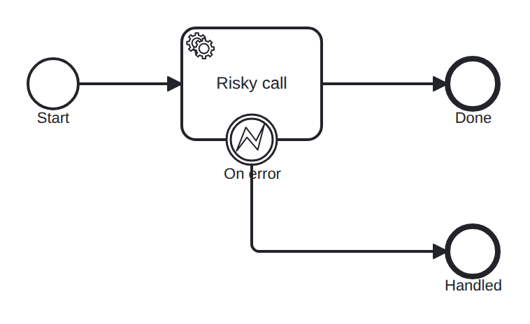

# boundary-error

Conformance micro-fixture: an interrupting boundary error event.

Start -&gt; serviceTask "call" -&gt; End "done", with a boundary error event catching error code "BOOM" on "call" and routing to End "handled". The driver plays a worker that throws the business error (ThrowError) instead of completing the job; the boundary catches it, interrupts the host, and the token leaves via the error path to "handled". Driver: ThrowError("call", "BOOM").

- **Model:** [`boundary-error.bpmn`](../../models/boundary-error.bpmn)
- **Features:** `boundary-error` (Interrupting boundary error event)

## How it is driven

**Start:** explicit `CreateInstance` on the root process.

**Steps:**

1. Throw business error `BOOM` from job `call` so a boundary error event catches it.

## Expected outcome

- **Completed:** yes
- **Path:** `start` → `call` → `on_error` → `handled`

---
_Generated from `conformance/scenario.go` by `go test ./conformance -update`. Do not edit by hand._
