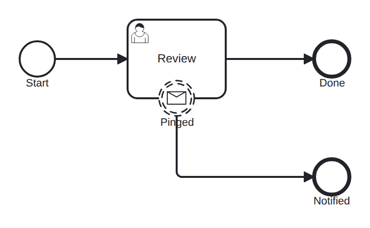

# boundary-message-noninterrupting

Conformance micro-fixture: a non-interrupting boundary message.

Start -&gt; userTask "review" -&gt; End "done", with a non-interrupting boundary message ("ping", correlation key "K") on "review" routing to End "notified". When the message arrives the boundary spawns a *parallel* token to "notified" while the host keeps running — the defining property of non-interrupting. The instance finishes only once both tokens end. Driver: Publish("ping", "K") then Complete("review").

- **Model:** [`boundary-message-noninterrupting.bpmn`](../../models/boundary-message-noninterrupting.bpmn)
- **Features:** `boundary-message-noninterrupting` (Non-interrupting boundary message event)

## How it is driven

**Start:** explicit `CreateInstance` on the root process.

**Steps:**

1. Publish message `ping` (key `K`).
2. Complete job `review`.

## Expected outcome

- **Completed:** yes
- **Path:** `start` → `review` → `pinged` → `notified` → `done`

## What is verified

The outcome above is not asserted once — it is cross-checked by several
independent oracles that must all agree, so a wrong result cannot slip through:

- **Golden trace** — the exact path, variables, and data objects above are
  compared byte-for-byte against a committed golden file; any drift fails the suite.
- **Replay equivalence (invariant I4)** — the scenario runs live, then replays
  from its event log; both must reach an identical state, proving recovery is
  deterministic and loses nothing.
- **Structural invariants** — the finished run must leave no orphan tokens and
  honor the engine's six state invariants (see `docs/architecture/invariants.md`).

## Run it yourself

- **Locally:** `go test ./conformance -run 'TestScenarios/boundary-message-noninterrupting'`
- **Portable case:** the language-neutral form lives in [`../../tck/cases/boundary-message-noninterrupting`](../../tck/cases/boundary-message-noninterrupting) (`model.bpmn` + `case.json` + `expected.json`), so another engine can replay it without reading Go.

---
_Generated from `conformance/scenario.go` by `go test ./conformance -update`. Do not edit by hand._
