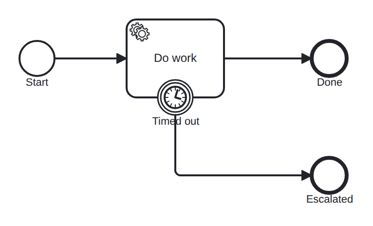

# boundary-timer-interrupting

Conformance micro-fixture: an interrupting boundary timer.

Start -&gt; serviceTask "work" -&gt; End "done", with an interrupting boundary timer (PT30S) on "work" routing to End "escalated". The token parks on the service job; when the timer comes due it interrupts the host (its job is discarded) and the token leaves via the boundary event to "escalated". Driver: Wait(31s) — the host job is never completed, so reaching "escalated" is the whole point.

- **Model:** [`boundary-timer-interrupting.bpmn`](../../models/boundary-timer-interrupting.bpmn)
- **Features:** `boundary-timer-interrupting` (Interrupting boundary timer event)

## How it is driven

**Start:** explicit `CreateInstance` on the root process.

**Steps:**

1. Advance the clock by `31s`, firing any timer that comes due.

## Expected outcome

- **Completed:** yes
- **Path:** `start` → `work` → `timeout` → `escalated`

---
_Generated from `conformance/scenario.go` by `go test ./conformance -update`. Do not edit by hand._
