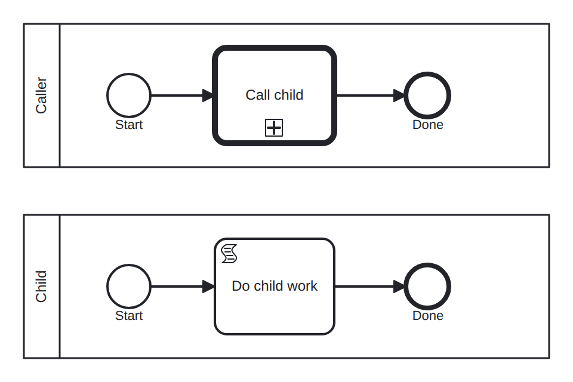

# call-activity

Conformance micro-fixture: a call activity invoking a child process.

Two processes in one model. The root "call-parent" runs Start -&gt; callActivity "call" -&gt; End; reaching the call activity creates an instance of "call-child" (Start -&gt; script -&gt; End) and waits for it. The child is in-engine, so it self-completes, and the parent's call activity then completes. The scenario's Root is "call-parent"; the trace captured is the parent's, and the child instance is filtered out by definition key.

- **Model:** [`call-activity.bpmn`](../../models/call-activity.bpmn)
- **Features:** `call-activity` (Call activity invoking a child process)

## How it is driven

**Start:** explicit `CreateInstance` on the root process.

**Steps:** _self-completing — the model runs to completion on its own (in-engine scripts, no parked token)._

## Expected outcome

- **Completed:** yes
- **Path:** `start` → `call` → `end`
- **Variables:** `child_done = 1`

---
_Generated from `conformance/scenario.go` by `go test ./conformance -update`. Do not edit by hand._
