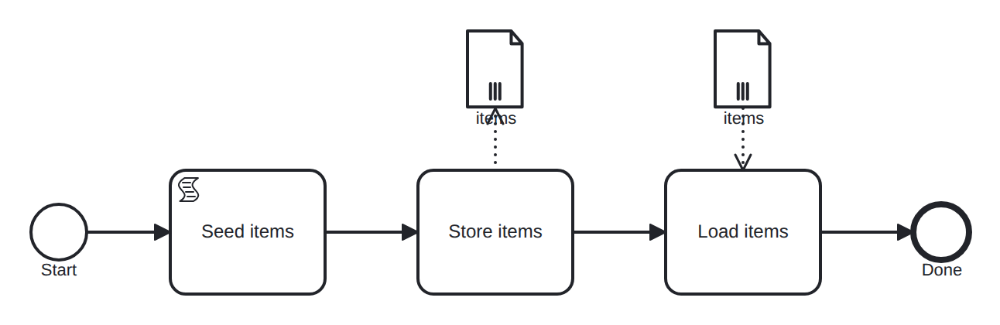

# collection-data-object

Conformance micro-fixture: a collection data object.

Start -&gt; script "seed" (raw = [10, 20, 30]) -&gt; task "store_items" -&gt; task "load_items" -&gt; End. The &lt;dataObject&gt; "items" is declared isCollection="true". The "store_items" task's output association writes the list into it; the "load_items" task's input association reads it back into "items_copy". The list round-trips, and the trace marks the object as a collection — items[collection]=[10,20,30] — a distinction that is compile-time metadata, not visible on the runtime value alone. Self-completing (pass-through tasks).

- **Model:** [`collection-data-object.bpmn`](../../models/collection-data-object.bpmn)
- **Features:** `collection-data-object` (Collection data object (isCollection list))

## How it is driven

**Start:** explicit `CreateInstance` on the root process.

**Steps:** _self-completing — the model runs to completion on its own (in-engine scripts, no parked token)._

## Expected outcome

- **Completed:** yes
- **Path:** `start` → `seed` → `store_items` → `load_items` → `end`
- **Variables:** `items_copy = [10,20,30]`, `raw = [10,20,30]`
- **Data objects:** `items[collection]=[10,20,30]`

---
_Generated from `conformance/scenario.go` by `go test ./conformance -update`. Do not edit by hand._
