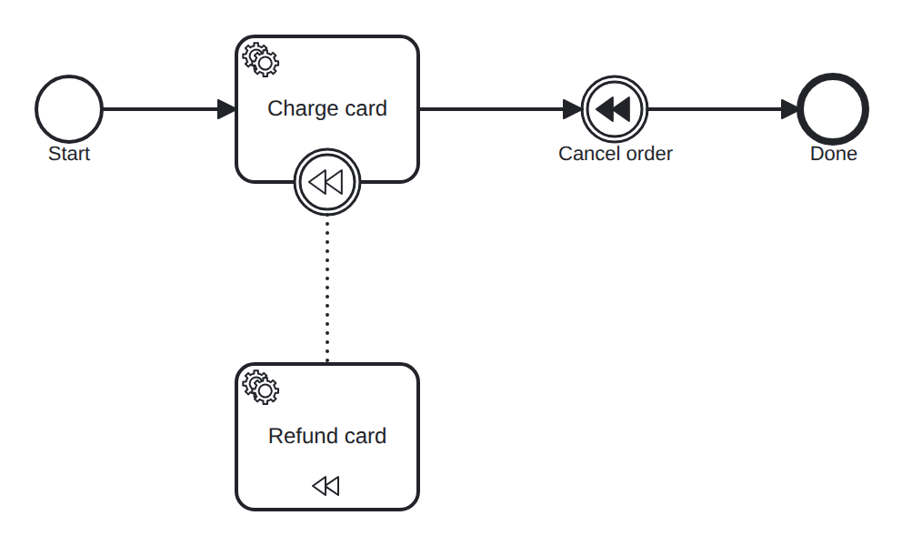

# compensation

Conformance micro-fixture: compensation.

Start -&gt; serviceTask "charge" (compensable) -&gt; intermediate throw "cancel" -&gt; End "done". The "charge" activity carries a compensation boundary event linked by a BPMN &lt;association&gt; to the "refund" handler (isForCompensation). Once charge has completed, reaching the "cancel" throw compensates it: the engine runs the refund handler for the completed charge, and only when it finishes does the throw continue to "done". Driver: Complete("charge") then Complete("refund").

- **Model:** [`compensation.bpmn`](../../models/compensation.bpmn)
- **Features:** `compensation` (Compensation via a boundary and a compensation throw)

## How it is driven

**Start:** explicit `CreateInstance` on the root process.

**Steps:**

1. Complete job `charge`.
2. Complete job `refund`.

## Expected outcome

- **Completed:** yes
- **Path:** `start` → `charge` → `cancel` → `refund` → `done`

---
_Generated from `conformance/scenario.go` by `go test ./conformance -update`. Do not edit by hand._
