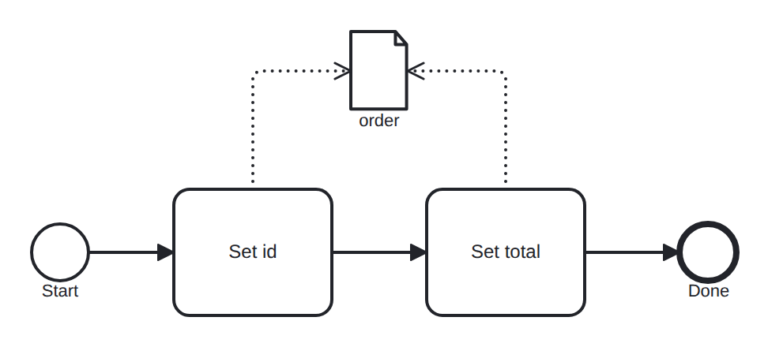

# data-object-fields

Conformance micro-fixture: field-level data-object writes (ADR-0060).

Start -&gt; task "set_id" -&gt; task "set_total" -&gt; End. The &lt;dataObject&gt; "order" starts unset. Each pass-through task's data output association targets a single member via &lt;assignment&gt;&lt;to&gt;: "set_id" writes order.id, "set_total" writes order.total. The engine reads the object's current JSON, sets that one member, and writes the merged value back — so the object accrues field by field, and the first member write creates it from unset. The captured trace shows the merged order={"id":"ORD-1","total":100}. Self-completing (pass-through tasks).

- **Model:** [`data-object-fields.bpmn`](../../models/data-object-fields.bpmn)
- **Features:** `field-level-data-object` (Field-level data-object writes (accrue members))

## How it is driven

**Start:** explicit `CreateInstance` on the root process.

**Steps:** _self-completing — the model runs to completion on its own (in-engine scripts, no parked token)._

## Expected outcome

- **Completed:** yes
- **Path:** `start` → `set_id` → `set_total` → `end`
- **Data objects:** `order={"id":"ORD-1","total":100}`

---
_Generated from `conformance/scenario.go` by `go test ./conformance -update`. Do not edit by hand._
