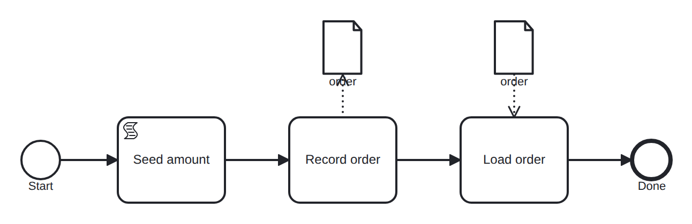

# data-object

Conformance micro-fixture: a first-class data object, written then read.

Start -&gt; script "seed" (amount = 100) -&gt; task "record" -&gt; task "load" -&gt; End. A &lt;dataObject&gt; "order" is seeded at instance creation with data state "received". The "record" task's data OUTPUT association writes it from the "amount" variable and, via a reference carrying data state "approved", advances its state received -&gt; approved. The "load" task's data INPUT association then reads the object back into the "order_copy" variable. Data flows variable -&gt; data object -&gt; variable, and the object's state advances along the way — the captured trace shows both order_copy=100 and order[approved]=100. The record and load tasks are pass-through (no execution semantics), so the model self-completes.

- **Model:** [`data-object.bpmn`](../../models/data-object.bpmn)
- **Features:** `data-object` (First-class data object: output/input associations and data state)

## How it is driven

**Start:** explicit `CreateInstance` on the root process.

**Steps:** _self-completing — the model runs to completion on its own (in-engine scripts, no parked token)._

## Expected outcome

- **Completed:** yes
- **Path:** `start` → `seed` → `record` → `load` → `end`
- **Variables:** `amount = 100`, `order_copy = 100`
- **Data objects:** `order[approved]=100`

---
_Generated from `conformance/scenario.go` by `go test ./conformance -update`. Do not edit by hand._
