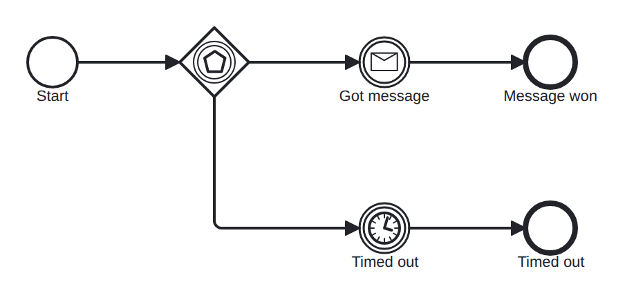

# event-gateway-timer

Conformance micro-fixture: an event-based gateway (deferred choice).

Start -&gt; eventBasedGateway -&gt; races a message catch ("go", keyless) against a timer catch (PT30S). Whichever fires first wins; the other is canceled. The outcome is decided by the environment, not by data — that is the deferred choice. One model, two scenarios: the message-driven run reaches "end_msg", the timer-driven run reaches "end_timeout".

- **Model:** [`event-based-gateway.bpmn`](../../models/event-based-gateway.bpmn)
- **Features:** `event-based-gateway` (Event-based gateway (deferred choice))
- **Control-flow patterns:** WCP-16 (Deferred Choice)

## How it is driven

**Start:** explicit `CreateInstance` on the root process.

**Steps:**

1. Advance the clock by `31s`, firing any timer that comes due.

## Expected outcome

- **Completed:** yes
- **Path:** `start` → `gw` → `got_msg` → `timed_out` → `end_timeout`

## What is verified

The outcome above is not asserted once — it is cross-checked by several
independent oracles that must all agree, so a wrong result cannot slip through:

- **Golden trace** — the exact path, variables, and data objects above are
  compared byte-for-byte against a committed golden file; any drift fails the suite.
- **Replay equivalence (invariant I4)** — the scenario runs live, then replays
  from its event log; both must reach an identical state, proving recovery is
  deterministic and loses nothing.
- **Structural invariants** — the finished run must leave no orphan tokens and
  honor the engine's six state invariants (see `docs/architecture/invariants.md`).

## Run it yourself

- **Locally:** `go test ./conformance -run 'TestScenarios/event-gateway-timer'`
- **Portable case:** the language-neutral form lives in [`../../tck/cases/event-gateway-timer`](../../tck/cases/event-gateway-timer) (`model.bpmn` + `case.json` + `expected.json`), so another engine can replay it without reading Go.

---
_Generated from `conformance/scenario.go` by `go test ./conformance -update`. Do not edit by hand._
