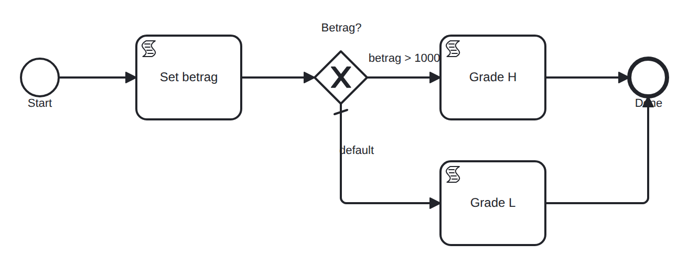

# exclusive-gateway

Conformance micro-fixture: data-based exclusive choice with a default flow.

Start -&gt; script "set_betrag" (= 250 -&gt; betrag) -&gt; exclusive gateway. The gateway takes "f_high" when betrag &gt; 1000, otherwise the default "f_low". Seeded with betrag = 250, so the default branch fires deterministically and grade becomes "L". Realizes WCP-4 (Exclusive Choice) and WCP-5 (Simple Merge).

- **Model:** [`exclusive-gateway.bpmn`](../../models/exclusive-gateway.bpmn)
- **Features:** `exclusive-gateway` (Data-based exclusive gateway with default flow), `script-task` (Inline FEEL script task (in-engine, no worker))
- **Control-flow patterns:** WCP-4 (Exclusive Choice), WCP-5 (Simple Merge)

## How it is driven

**Start:** explicit `CreateInstance` on the root process.

**Steps:** _self-completing — the model runs to completion on its own (in-engine scripts, no parked token)._

## Expected outcome

- **Completed:** yes
- **Path:** `start` → `set_betrag` → `gw` → `low` → `end`
- **Variables:** `betrag = 250`, `grade = L`

---
_Generated from `conformance/scenario.go` by `go test ./conformance -update`. Do not edit by hand._
