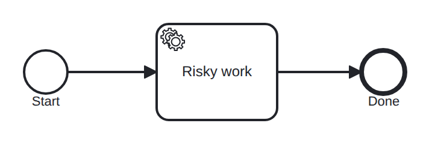

# incident

Conformance micro-fixture: a job failure that raises and resolves an incident.

Start -&gt; serviceTask "risky" -&gt; End. The driver plays a worker that fails the job with no retries left (Fail), which raises an incident and takes the job off the activatable index; then an operator resolves the incident with fresh retries (Resolve), re-activating the job; then the worker completes it (Complete). The Resolve step fails loudly if no incident is present, so this scenario only passes if the incident was genuinely raised.

- **Model:** [`incident.bpmn`](../../models/incident.bpmn)
- **Features:** `incident` (Job failure raises an incident; resolve resumes it)

## How it is driven

**Start:** explicit `CreateInstance` on the root process.

**Steps:**

1. Fail job `risky` with no retries — raises an incident (`boom`).
2. Resolve the incident on `risky`, re-activating its job.
3. Complete job `risky`.

## Expected outcome

- **Completed:** yes
- **Path:** `start` → `risky` → `end`

## What is verified

The outcome above is not asserted once — it is cross-checked by several
independent oracles that must all agree, so a wrong result cannot slip through:

- **Golden trace** — the exact path, variables, and data objects above are
  compared byte-for-byte against a committed golden file; any drift fails the suite.
- **Replay equivalence (invariant I4)** — the scenario runs live, then replays
  from its event log; both must reach an identical state, proving recovery is
  deterministic and loses nothing.
- **Structural invariants** — the finished run must leave no orphan tokens and
  honor the engine's six state invariants (see `docs/architecture/invariants.md`).

## Run it yourself

- **Locally:** `go test ./conformance -run 'TestScenarios/incident'`
- **Portable case:** the language-neutral form lives in [`../../tck/cases/incident`](../../tck/cases/incident) (`model.bpmn` + `case.json` + `expected.json`), so another engine can replay it without reading Go.

---
_Generated from `conformance/scenario.go` by `go test ./conformance -update`. Do not edit by hand._
