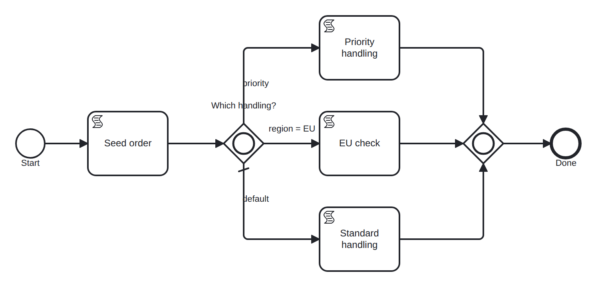

# inclusive-gateway

Conformance micro-fixture: an inclusive (OR) gateway.

Start -&gt; script "seed" (order = {priority: true, region: "EU"}) -&gt; inclusive split -&gt; up to three branches -&gt; inclusive join -&gt; End. The split opens every branch whose condition holds (priority, EU region) plus the default only if none do; the join waits for exactly the branches that opened, then fires once. Seeded so priority and EU both hold and the default "standard" branch is suppressed — the join synchronizes those two. Self-completing (inline scripts). Realizes WCP-6 (Multi-Choice) and WCP-7 (Structured Synchronizing Merge).

- **Model:** [`inclusive-gateway.bpmn`](../../models/inclusive-gateway.bpmn)
- **Features:** `inclusive-gateway` (Inclusive (OR) gateway split and synchronizing join)
- **Control-flow patterns:** WCP-6 (Multi-Choice), WCP-7 (Structured Synchronizing Merge)

## How it is driven

**Start:** explicit `CreateInstance` on the root process.

**Steps:** _self-completing — the model runs to completion on its own (in-engine scripts, no parked token)._

## Expected outcome

- **Completed:** yes
- **Path:** `start` → `seed` → `split` → `priority` → `eu_check` → `join` → `join` → `end`
- **Variables:** `eu = done`, `order = {"priority":true,"region":"EU"}`, `prio = done`

## What is verified

The outcome above is not asserted once — it is cross-checked by several
independent oracles that must all agree, so a wrong result cannot slip through:

- **Golden trace** — the exact path, variables, and data objects above are
  compared byte-for-byte against a committed golden file; any drift fails the suite.
- **Replay equivalence (invariant I4)** — the scenario runs live, then replays
  from its event log; both must reach an identical state, proving recovery is
  deterministic and loses nothing.
- **Structural invariants** — the finished run must leave no orphan tokens and
  honor the engine's six state invariants (see `docs/architecture/invariants.md`).
- **Differential oracle** — the same case is run against an independent BPMN
  engine (Node's `bpmn-engine`) and both must agree on the outcome
  (opt-in: `go test -tags differential ./conformance/differential`).

## Run it yourself

- **Locally:** `go test ./conformance -run 'TestScenarios/inclusive-gateway'`
- **Portable case:** the language-neutral form lives in [`../../tck/cases/inclusive-gateway`](../../tck/cases/inclusive-gateway) (`model.bpmn` + `case.json` + `expected.json`), so another engine can replay it without reading Go.

---
_Generated from `conformance/scenario.go` by `go test ./conformance -update`. Do not edit by hand._
