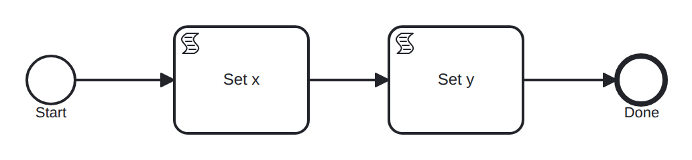

# linear-independent

Conformance micro-fixture: two independent effects in a straight line.

Start -&gt; (set_x: = 1 -&gt; x) -&gt; (set_y: = 2 -&gt; y) -&gt; End.

Metamorphic partner of parallel-independent.bpmn. The two tasks do not depend on each other, so serializing them (here) must yield the same effect projection as running them concurrently (there).

- **Model:** [`linear-independent.bpmn`](../../models/linear-independent.bpmn)
- **Features:** `sequence-flow` (Sequence flow between activities), `script-task` (Inline FEEL script task (in-engine, no worker))
- **Control-flow patterns:** WCP-1 (Sequence)
- **Metamorphic class:** `independent-effects`

## How it is driven

**Start:** explicit `CreateInstance` on the root process.

**Steps:** _self-completing — the model runs to completion on its own (in-engine scripts, no parked token)._

## Expected outcome

- **Completed:** yes
- **Path:** `start` → `set_x` → `set_y` → `end`
- **Variables:** `x = 1`, `y = 2`

## What is verified

The outcome above is not asserted once — it is cross-checked by several
independent oracles that must all agree, so a wrong result cannot slip through:

- **Golden trace** — the exact path, variables, and data objects above are
  compared byte-for-byte against a committed golden file; any drift fails the suite.
- **Replay equivalence (invariant I4)** — the scenario runs live, then replays
  from its event log; both must reach an identical state, proving recovery is
  deterministic and loses nothing.
- **Structural invariants** — the finished run must leave no orphan tokens and
  honor the engine's six state invariants (see `docs/architecture/invariants.md`).
- **Metamorphic equivalence** — this scenario is in the `independent-effects` group; it must
  produce the same observable effect as `parallel-independent`, even though the models differ.

## Run it yourself

- **Locally:** `go test ./conformance -run 'TestScenarios/linear-independent'`
- **Portable case:** the language-neutral form lives in [`../../tck/cases/linear-independent`](../../tck/cases/linear-independent) (`model.bpmn` + `case.json` + `expected.json`), so another engine can replay it without reading Go.

---
_Generated from `conformance/scenario.go` by `go test ./conformance -update`. Do not edit by hand._
