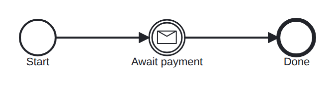

# message-catch

Conformance micro-fixture: an intermediate message catch event.

Start -&gt; intermediateCatchEvent "await_payment" -&gt; End. The token parks on a message subscription (name "payment-received", constant correlation key "K") until a matching message arrives. The driver delivers it with Publish("payment-received", "K", ...). Exercises the message driver path.

- **Model:** [`message-catch.bpmn`](../../models/message-catch.bpmn)
- **Features:** `message-catch` (Intermediate message catch event)

## How it is driven

**Start:** explicit `CreateInstance` on the root process.

**Steps:**

1. Publish message `payment-received` (key `K`).

## Expected outcome

- **Completed:** yes
- **Path:** `start` → `await_payment` → `end`

## What is verified

The outcome above is not asserted once — it is cross-checked by several
independent oracles that must all agree, so a wrong result cannot slip through:

- **Golden trace** — the exact path, variables, and data objects above are
  compared byte-for-byte against a committed golden file; any drift fails the suite.
- **Replay equivalence (invariant I4)** — the scenario runs live, then replays
  from its event log; both must reach an identical state, proving recovery is
  deterministic and loses nothing.
- **Structural invariants** — the finished run must leave no orphan tokens and
  honor the engine's six state invariants (see `docs/architecture/invariants.md`).

## Run it yourself

- **Locally:** `go test ./conformance -run 'TestScenarios/message-catch'`
- **Portable case:** the language-neutral form lives in [`../../tck/cases/message-catch`](../../tck/cases/message-catch) (`model.bpmn` + `case.json` + `expected.json`), so another engine can replay it without reading Go.

---
_Generated from `conformance/scenario.go` by `go test ./conformance -update`. Do not edit by hand._
