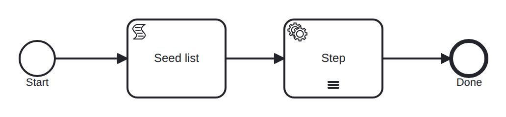

# multi-instance-sequential

Conformance micro-fixture: a sequential multi-instance activity.

Start -&gt; script "seed" (items = [1, 2, 3]) -&gt; sequential multi-instance service task "step" -&gt; End. A sequential multi-instance runs its iterations one at a time: only one job is ever active, so the driver completes them one after another with Complete("step") x3 — the very fact that each Complete resolves a single job (never an ambiguous set) is the sequential property. Contrast the parallel multi-instance, which activates every iteration's work at once.

- **Model:** [`multi-instance-sequential.bpmn`](../../models/multi-instance-sequential.bpmn)
- **Features:** `multi-instance-sequential` (Sequential multi-instance activity)

## How it is driven

**Start:** explicit `CreateInstance` on the root process.

**Steps:**

1. Complete job `step`.
2. Complete job `step`.
3. Complete job `step`.

## Expected outcome

- **Completed:** yes
- **Path:** `start` → `seed` → `step` → `step` → `step` → `step` → `end`
- **Variables:** `items = [1,2,3]`

## What is verified

The outcome above is not asserted once — it is cross-checked by several
independent oracles that must all agree, so a wrong result cannot slip through:

- **Golden trace** — the exact path, variables, and data objects above are
  compared byte-for-byte against a committed golden file; any drift fails the suite.
- **Replay equivalence (invariant I4)** — the scenario runs live, then replays
  from its event log; both must reach an identical state, proving recovery is
  deterministic and loses nothing.
- **Structural invariants** — the finished run must leave no orphan tokens and
  honor the engine's six state invariants (see `docs/architecture/invariants.md`).

## Run it yourself

- **Locally:** `go test ./conformance -run 'TestScenarios/multi-instance-sequential'`
- **Portable case:** the language-neutral form lives in [`../../tck/cases/multi-instance-sequential`](../../tck/cases/multi-instance-sequential) (`model.bpmn` + `case.json` + `expected.json`), so another engine can replay it without reading Go.

---
_Generated from `conformance/scenario.go` by `go test ./conformance -update`. Do not edit by hand._
