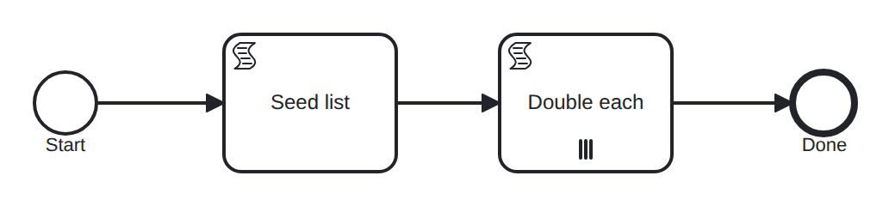

# multi-instance

Conformance micro-fixture: a parallel multi-instance activity.

Start -&gt; script "seed" (items = [10, 20, 30]) -&gt; multi-instance script "double" -&gt; End. The multi-instance runs the body once per element of the input collection, binding each element to "item"; each iteration's inline script doubles it, and the outputElement aggregates into the "results" collection. The body is in-engine, so all iterations self-complete and the parallel join fires once they all finish.

- **Model:** [`multi-instance.bpmn`](../../models/multi-instance.bpmn)
- **Features:** `multi-instance` (Parallel multi-instance activity with output collection)

## How it is driven

**Start:** explicit `CreateInstance` on the root process.

**Steps:** _self-completing — the model runs to completion on its own (in-engine scripts, no parked token)._

## Expected outcome

- **Completed:** yes
- **Path:** `start` → `seed` → `double` → `double` → `double` → `double` → `end`
- **Variables:** `items = [10,20,30]`, `results = [20,40,60]`

---
_Generated from `conformance/scenario.go` by `go test ./conformance -update`. Do not edit by hand._
