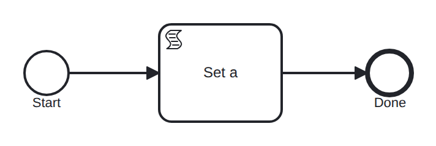

# sequence

Conformance micro-fixture: a plain sequence.

Start -&gt; script "set_a" (= 1 -&gt; a) -&gt; End. The smallest self-completing model: one inline FEEL script means the token never parks, so an instance runs straight to the end event with no worker attached. Realizes WCP-1 (Sequence).

Carries hand-authored BPMN-DI so it renders cleanly in the catalog; the layout is diagram-only and does not affect execution (the compiler ignores it).

- **Model:** [`sequence.bpmn`](../../models/sequence.bpmn)
- **Features:** `start-end-event` (None start and end events), `sequence-flow` (Sequence flow between activities), `script-task` (Inline FEEL script task (in-engine, no worker))
- **Control-flow patterns:** WCP-1 (Sequence)

## How it is driven

**Start:** explicit `CreateInstance` on the root process.

**Steps:** _self-completing — the model runs to completion on its own (in-engine scripts, no parked token)._

## Expected outcome

- **Completed:** yes
- **Path:** `start` → `set_a` → `end`
- **Variables:** `a = 1`

---
_Generated from `conformance/scenario.go` by `go test ./conformance -update`. Do not edit by hand._
