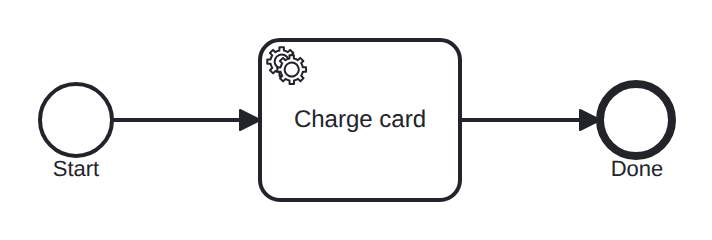

# service-task

Conformance micro-fixture: a worker-backed service task that parks a token.

Start -&gt; serviceTask "charge" (job type "payment") -&gt; End. The token parks on the job until an external worker completes it. The driver plays the worker with Complete("charge", Str("status", "captured")), and the output variable flows into the instance scope. Exercises the job-completion driver path with outputs.

- **Model:** [`service-task.bpmn`](../../models/service-task.bpmn)
- **Features:** `service-task` (Service task (worker-completed job with outputs))

## How it is driven

**Start:** explicit `CreateInstance` on the root process.

**Steps:**

1. Complete job `charge` with `status = captured`.

## Expected outcome

- **Completed:** yes
- **Path:** `start` → `charge` → `end`
- **Variables:** `status = captured`

---
_Generated from `conformance/scenario.go` by `go test ./conformance -update`. Do not edit by hand._
