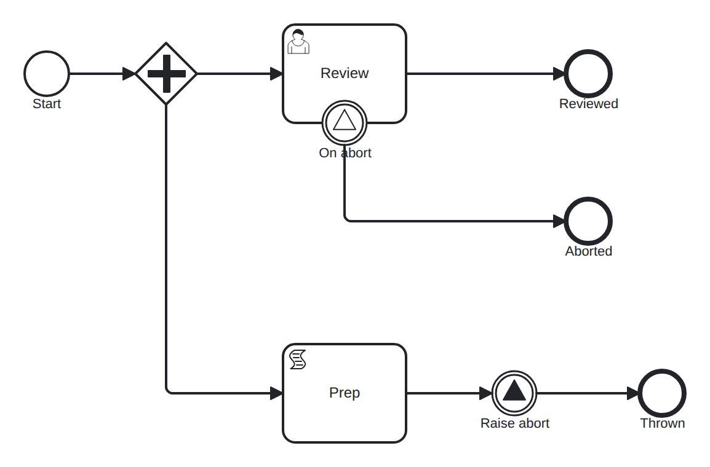

# signal-boundary

Conformance micro-fixture: an interrupting boundary signal event.

Start -&gt; parallel fork -&gt; two branches: A: userTask "review" with an interrupting boundary signal "abort" -&gt; "aborted" B: script "prep" -&gt; intermediate signal throw "abort" -&gt; "thrown" When branch B throws "abort", branch A's boundary signal fires; being interrupting it cancels the still-parked "review" and routes to "aborted". The script keeps the throw one hop behind the boundary's arming, so the boundary is always subscribed first — self-completing, no driver. The user task is never completed; being interrupted is the point.

- **Model:** [`signal-boundary.bpmn`](../../models/signal-boundary.bpmn)
- **Features:** `signal-boundary` (Interrupting boundary signal event)

## How it is driven

**Start:** explicit `CreateInstance` on the root process.

**Steps:** _self-completing — the model runs to completion on its own (in-engine scripts, no parked token)._

## Expected outcome

- **Completed:** yes
- **Path:** `start` → `fork` → `review` → `prep` → `on_abort` → `raise_abort` → `aborted` → `thrown`
- **Variables:** `ready = 1`

## What is verified

The outcome above is not asserted once — it is cross-checked by several
independent oracles that must all agree, so a wrong result cannot slip through:

- **Golden trace** — the exact path, variables, and data objects above are
  compared byte-for-byte against a committed golden file; any drift fails the suite.
- **Replay equivalence (invariant I4)** — the scenario runs live, then replays
  from its event log; both must reach an identical state, proving recovery is
  deterministic and loses nothing.
- **Structural invariants** — the finished run must leave no orphan tokens and
  honor the engine's six state invariants (see `docs/architecture/invariants.md`).

## Run it yourself

- **Locally:** `go test ./conformance -run 'TestScenarios/signal-boundary'`
- **Portable case:** the language-neutral form lives in [`../../tck/cases/signal-boundary`](../../tck/cases/signal-boundary) (`model.bpmn` + `case.json` + `expected.json`), so another engine can replay it without reading Go.

---
_Generated from `conformance/scenario.go` by `go test ./conformance -update`. Do not edit by hand._
