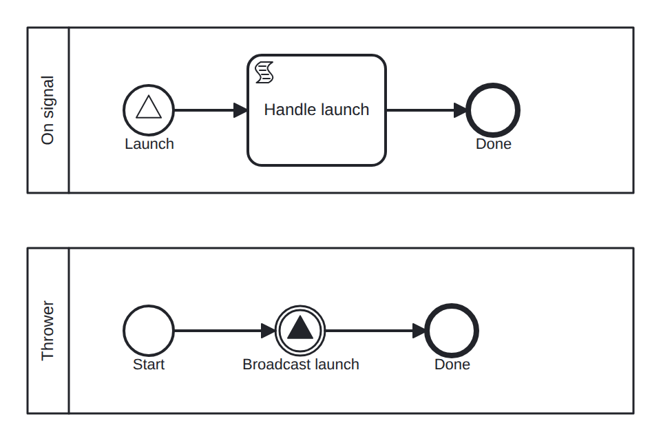

# signal-start

Conformance micro-fixture: a signal start event.

Two processes. "on-signal" begins with a signal start event for "launch" (signalStart "on_launch" -&gt; script "handle" -&gt; End); deploying it arms the subscription. "thrower" is the trigger (Start -&gt; signal throw "launch" -&gt; End). The scenario instantiates the thrower; its broadcast births a fresh "on-signal" instance, which runs to completion. Root is "on-signal", so the captured trace is the signal-started instance's; the thrower instance is filtered out by definition key.

- **Model:** [`signal-start.bpmn`](../../models/signal-start.bpmn)
- **Features:** `signal-start` (Signal start event (broadcast births an instance))

## How it is driven

**Start:** signal start — instantiating the `thrower` process broadcasts the signal that births the instance.

**Steps:** _self-completing — the model runs to completion on its own (in-engine scripts, no parked token)._

## Expected outcome

- **Completed:** yes
- **Path:** `on_launch` → `handle` → `end`
- **Variables:** `handled = 1`

---
_Generated from `conformance/scenario.go` by `go test ./conformance -update`. Do not edit by hand._
