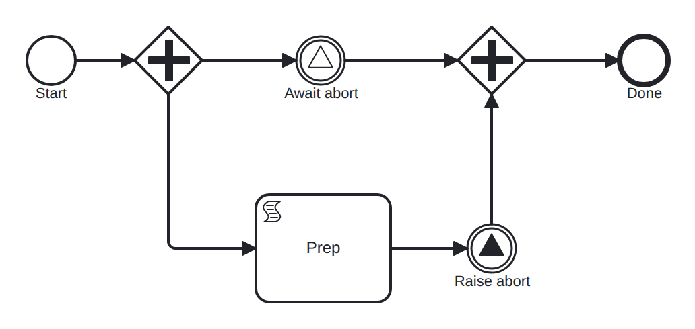

# signal-throw-catch

Conformance micro-fixture: a signal broadcast within one instance.

Start -&gt; parallel fork -&gt; two branches that rendezvous on a signal: A: intermediate signal catch "abort" -&gt; join B: script "prep" -&gt; intermediate signal throw "abort" -&gt; join When branch B's throw is reached it broadcasts "abort", firing branch A's armed catch; the join then synchronizes and the instance ends. The script on the throw branch keeps the throw one hop behind the catch's arming, so the catch is always subscribed before the broadcast — self-completing, no driver needed.

- **Model:** [`signal-throw-catch.bpmn`](../../models/signal-throw-catch.bpmn)
- **Features:** `signal` (Signal throw and catch (1:n broadcast))

## How it is driven

**Start:** explicit `CreateInstance` on the root process.

**Steps:** _self-completing — the model runs to completion on its own (in-engine scripts, no parked token)._

## Expected outcome

- **Completed:** yes
- **Path:** `start` → `fork` → `await_abort` → `prep` → `raise_abort` → `join` → `join` → `end`
- **Variables:** `ready = 1`

---
_Generated from `conformance/scenario.go` by `go test ./conformance -update`. Do not edit by hand._
