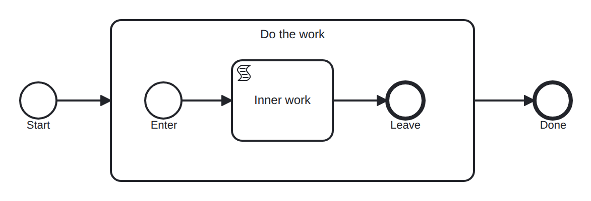

# subprocess

Conformance micro-fixture: an embedded subprocess.

Start -&gt; subProcess "sub" { inner_start -&gt; script "inner_work" -&gt; inner_end } -&gt; End. A token enters the subprocess, runs its inner flow to the inner end event, then leaves the subprocess and continues. The inner script is in-engine, so the whole thing self-completes.

- **Model:** [`subprocess.bpmn`](../../models/subprocess.bpmn)
- **Features:** `embedded-subprocess` (Embedded subprocess)

## How it is driven

**Start:** explicit `CreateInstance` on the root process.

**Steps:** _self-completing — the model runs to completion on its own (in-engine scripts, no parked token)._

## Expected outcome

- **Completed:** yes
- **Path:** `start` → `sub` → `inner_start` → `inner_work` → `inner_end` → `end`

---
_Generated from `conformance/scenario.go` by `go test ./conformance -update`. Do not edit by hand._
