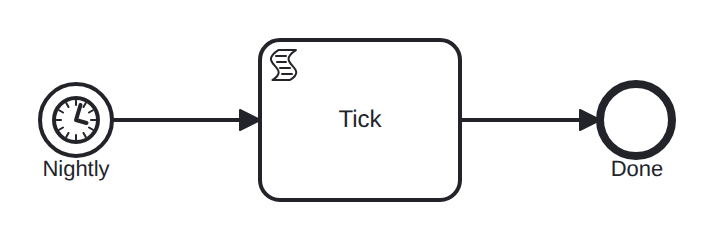

# timer-start

Conformance micro-fixture: a timer start event.

A duration timer (PT30S) starts a new instance: timerStart "on_schedule" -&gt; script "tick" -&gt; End. There is no CreateInstance call — the suite's Start hook arms the start timer, advances the clock past its due date with TimerStart(31s), and the timer births the instance, which the inline script self-completes.

- **Model:** [`timer-start.bpmn`](../../models/timer-start.bpmn)
- **Features:** `timer-start` (Timer start event)

## How it is driven

**Start:** timer start — an armed timer firing after `31s` births the instance.

**Steps:** _self-completing — the model runs to completion on its own (in-engine scripts, no parked token)._

## Expected outcome

- **Completed:** yes
- **Path:** `on_schedule` → `tick` → `end`
- **Variables:** `fired = 1`

## What is verified

The outcome above is not asserted once — it is cross-checked by several
independent oracles that must all agree, so a wrong result cannot slip through:

- **Golden trace** — the exact path, variables, and data objects above are
  compared byte-for-byte against a committed golden file; any drift fails the suite.
- **Replay equivalence (invariant I4)** — the scenario runs live, then replays
  from its event log; both must reach an identical state, proving recovery is
  deterministic and loses nothing.
- **Structural invariants** — the finished run must leave no orphan tokens and
  honor the engine's six state invariants (see `docs/architecture/invariants.md`).

## Run it yourself

- **Locally:** `go test ./conformance -run 'TestScenarios/timer-start'`
- **Portable case:** the language-neutral form lives in [`../../tck/cases/timer-start`](../../tck/cases/timer-start) (`model.bpmn` + `case.json` + `expected.json`), so another engine can replay it without reading Go.

---
_Generated from `conformance/scenario.go` by `go test ./conformance -update`. Do not edit by hand._
