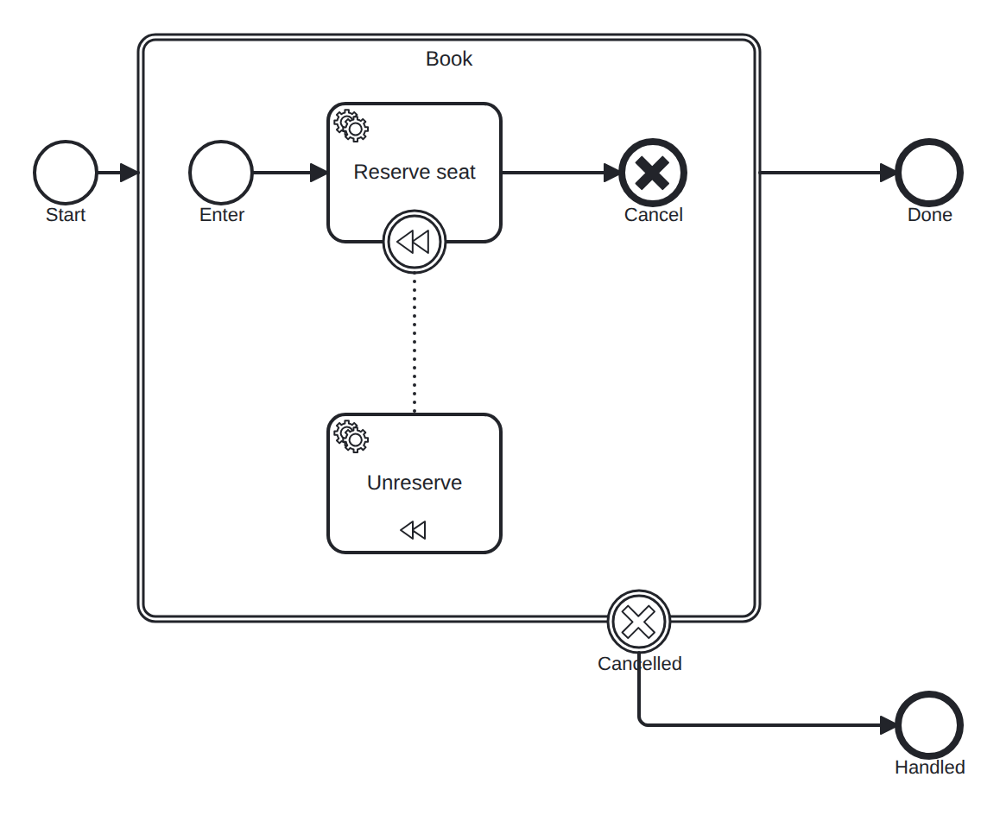

# transaction-cancel

Conformance micro-fixture: a transaction subprocess with cancel (ADR-0108).

Start -&gt; transaction "book" { ts -&gt; serviceTask "reserve" -&gt; cancel end "cancelled" } -&gt; End "done", with a cancel boundary on the transaction routing to End "handled". "reserve" is compensable (a compensation boundary links it to the "unreserve" handler). Once reserve completes, the flow reaches the cancel end event, which rolls the transaction back: the engine compensates the completed reserve (running unreserve), then the transaction's cancel boundary fires and routes to "handled" instead of "done". Driver: Complete("reserve") then Complete("unreserve").

- **Model:** [`transaction-cancel.bpmn`](../../models/transaction-cancel.bpmn)
- **Features:** `transaction-cancel` (Transaction subprocess with cancel end and cancel boundary)

## How it is driven

**Start:** explicit `CreateInstance` on the root process.

**Steps:**

1. Complete job `reserve`.
2. Complete job `unreserve`.

## Expected outcome

- **Completed:** yes
- **Path:** `start` → `book` → `ts` → `book_cancelled` → `reserve` → `cancelled` → `unreserve` → `handled`

## What is verified

The outcome above is not asserted once — it is cross-checked by several
independent oracles that must all agree, so a wrong result cannot slip through:

- **Golden trace** — the exact path, variables, and data objects above are
  compared byte-for-byte against a committed golden file; any drift fails the suite.
- **Replay equivalence (invariant I4)** — the scenario runs live, then replays
  from its event log; both must reach an identical state, proving recovery is
  deterministic and loses nothing.
- **Structural invariants** — the finished run must leave no orphan tokens and
  honor the engine's six state invariants (see `docs/architecture/invariants.md`).

## Run it yourself

- **Locally:** `go test ./conformance -run 'TestScenarios/transaction-cancel'`
- **Portable case:** the language-neutral form lives in [`../../tck/cases/transaction-cancel`](../../tck/cases/transaction-cancel) (`model.bpmn` + `case.json` + `expected.json`), so another engine can replay it without reading Go.

---
_Generated from `conformance/scenario.go` by `go test ./conformance -update`. Do not edit by hand._
