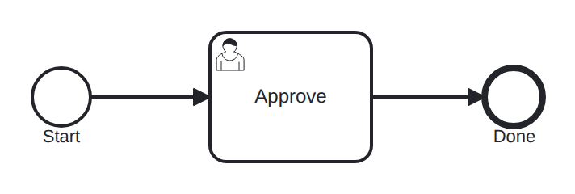

# user-task

Conformance micro-fixture: a human task that parks a token.

Start -&gt; userTask "approve" -&gt; End. A user task parks a job (its "worker" is a human); the token waits until the job is completed. The driver completes it with Complete("approve"). Exercises the job-completion driver path against a user task.

- **Model:** [`user-task.bpmn`](../../models/user-task.bpmn)
- **Features:** `user-task` (User task (human-completed job))

## How it is driven

**Start:** explicit `CreateInstance` on the root process.

**Steps:**

1. Complete job `approve`.

## Expected outcome

- **Completed:** yes
- **Path:** `start` → `approve` → `end`

---
_Generated from `conformance/scenario.go` by `go test ./conformance -update`. Do not edit by hand._
