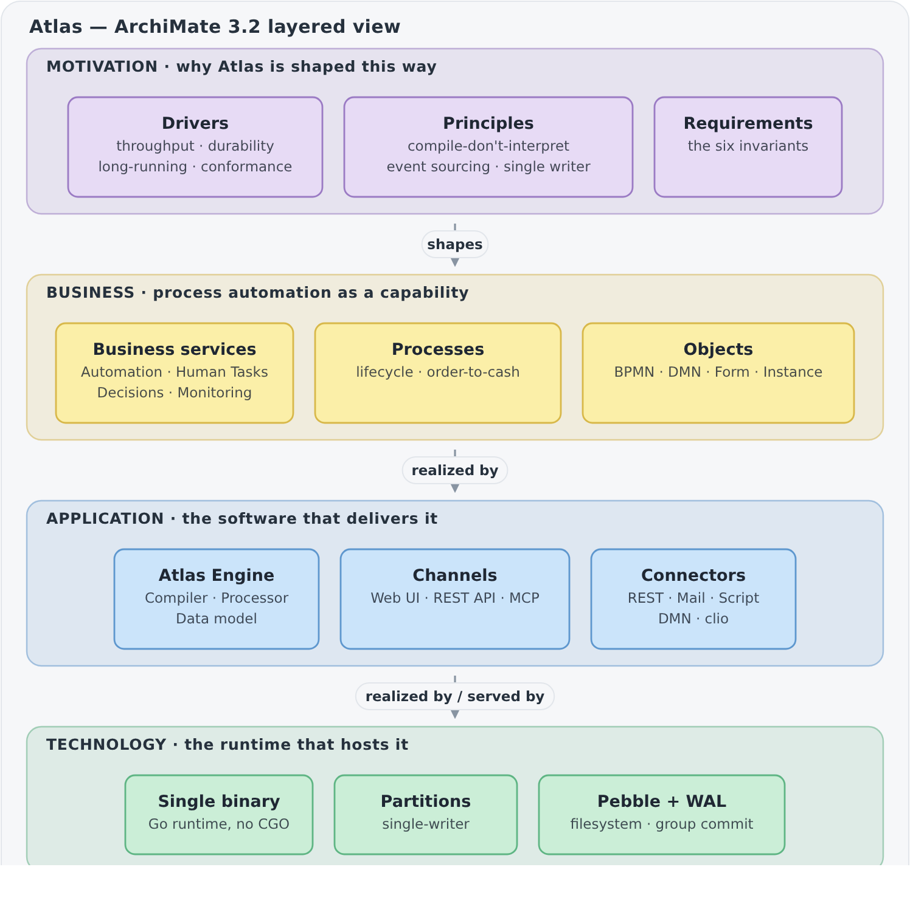
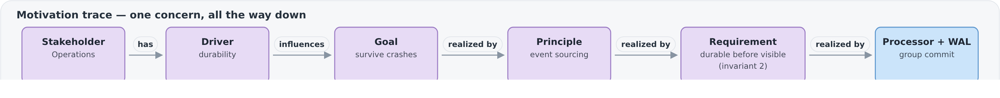
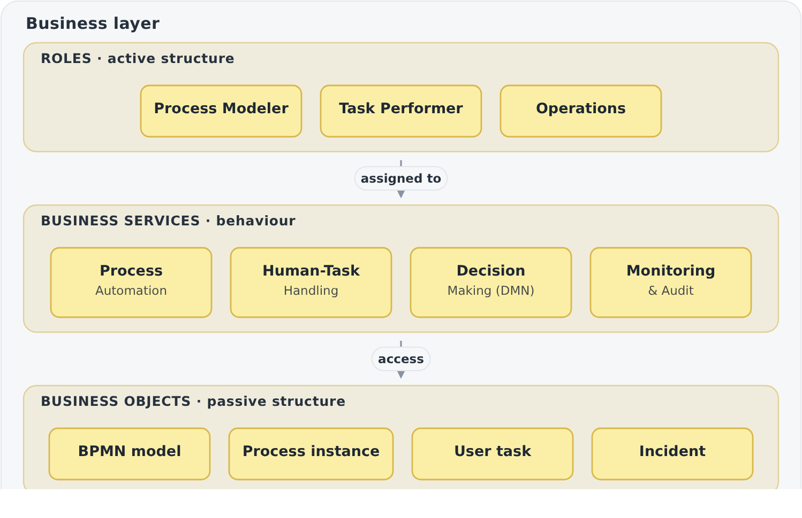
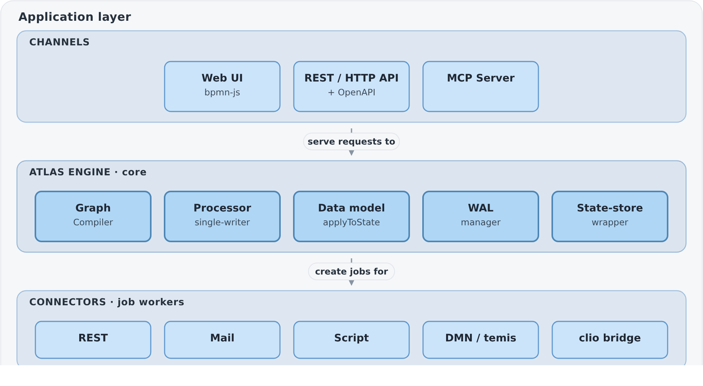
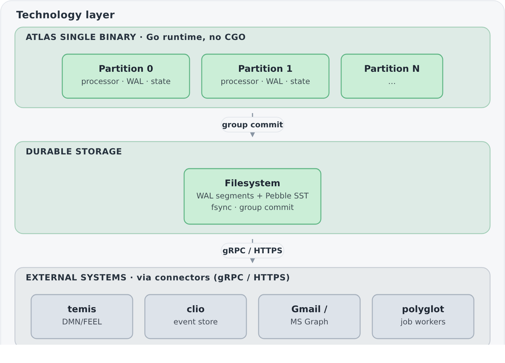

# Diagram rendering options — SVG vs PNG

This page exists to **compare embedding options** for the ArchiMate diagrams in
[`../enterprise-architecture.md`](../enterprise-architecture.md). It renders the same
diagrams once as **SVG** and once as **PNG** so the difference is visible directly on
GitHub. Pick one; the winner replaces the Mermaid blocks in the main document and the
other asset set is removed.

The diagrams are generated from a small script ([`gen_diagrams.py`](gen_diagrams.py)):
it emits the SVGs, and the PNGs are rasterized from them with headless Chromium at 2×
for sharpness (the exact command is in the script header). Editing the diagrams means
editing the script, not the assets by hand.

## Trade-offs at a glance

| Aspect | Mermaid (current) | **SVG** | **PNG** |
|--------|-------------------|---------|---------|
| Renders on GitHub | ✅ native | ✅ as image | ✅ as image |
| Sharp at any zoom | ✅ vector | ✅ vector | ❌ raster (2× mitigates) |
| Light/dark theme aware | ✅ (GitHub theme) | ✅ (embedded `prefers-color-scheme`) | ❌ single background¹ |
| File size (overview) | 0 (inline text) | ~10 KB | ~200 KB |
| Diff-friendly in git | ✅ text | ✅ text (XML) | ❌ binary blob |
| Layout control | ⚠️ auto-layout | ✅ exact | ✅ exact |
| Editable without tooling | ✅ | ⚠️ via script | ❌ via script + Chromium |

¹ PNG can be made theme-aware with two files behind a `<picture media="(prefers-color-scheme: dark)">`, at the cost of maintaining a dark render too.

**Recommendation:** SVG — it keeps the exact, designed layout *and* stays a small,
diffable, theme-aware text file. PNG is the fallback only if a target renderer (some
corporate wikis, PDF exporters) refuses SVG.

---

## Option A — SVG

```markdown

```


---

## Option B — PNG

```markdown

```










---

*Once you choose, tell me and I will wire the chosen format into
[`../enterprise-architecture.md`](../enterprise-architecture.md) and delete the unused
assets.*
