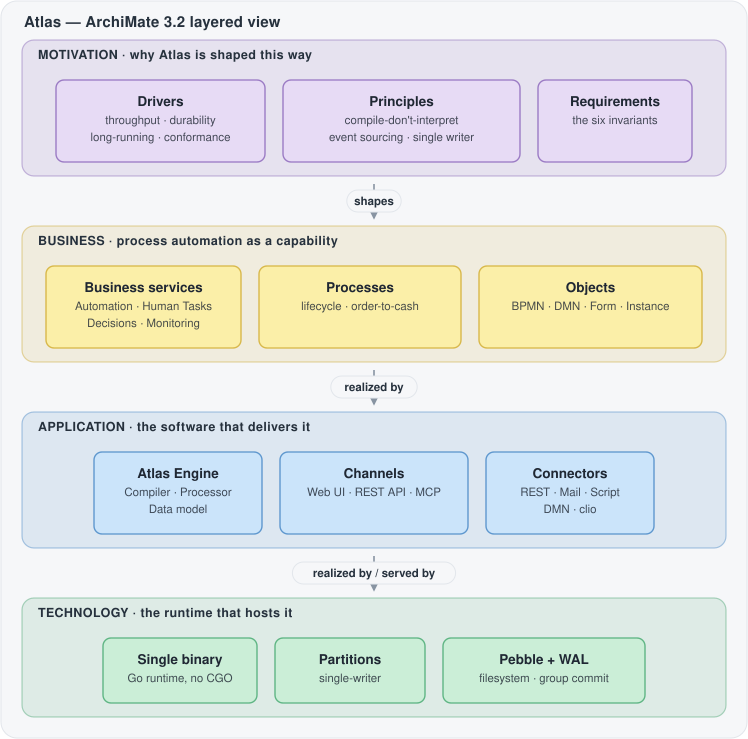
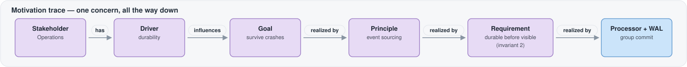
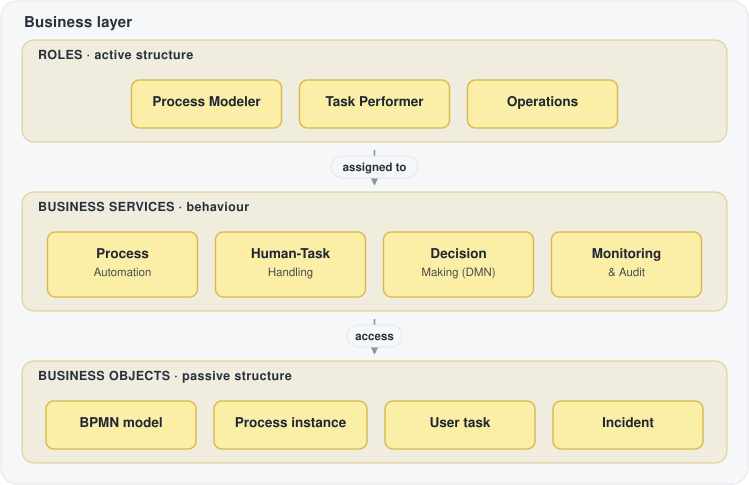
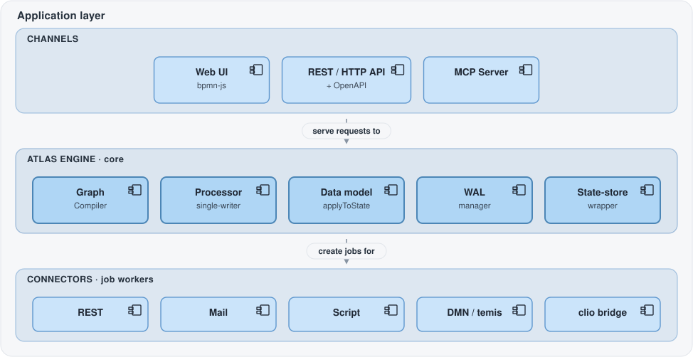
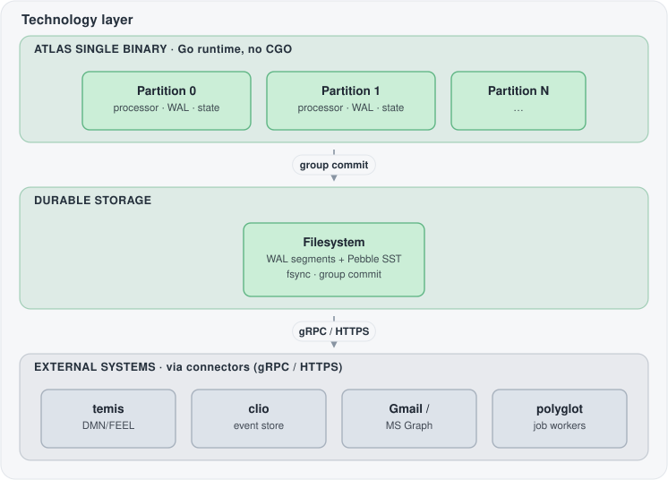
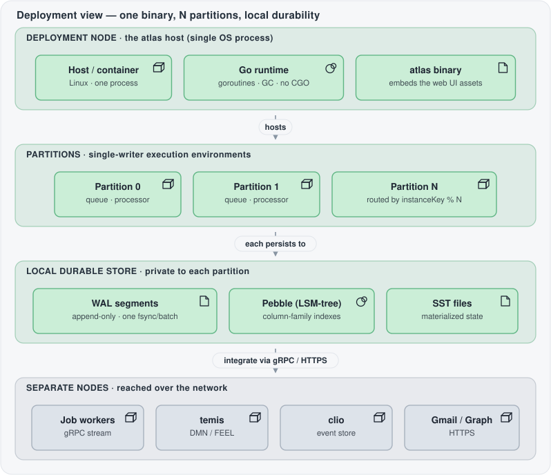
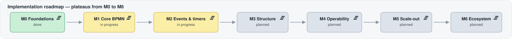

# Atlas Enterprise Architecture — an ArchiMate 3.2 view

This document models Atlas as an enterprise architecture using the
[ArchiMate® 3.2](https://www.opengroup.org/archimate-forum) notation of The Open
Group. Where [`ARCHITECTURE.md`](../ARCHITECTURE.md) explains *how the engine works
internally*, this view answers a different question: **who uses Atlas, what
capabilities it offers, and how those capabilities rest on software and
technology** — plus the **motivation** (stakeholders, drivers, goals, principles,
requirements) that shaped it.

It is a *layered view*: a communication aid for architects and stakeholders, not a
formal model export. The diagrams below are colour-coded to the ArchiMate layer convention (SVG, so they
stay sharp and adapt to GitHub's light/dark theme); the tables under each layer are
the detailed reference behind the boxes.

> **Notation cheat-sheet.** ArchiMate splits every layer into three *aspects* —
> **active structure** (who/what acts: roles, components, nodes), **behaviour**
> (what happens: services, processes, functions), and **passive structure** (what
> is acted upon: business/data objects, artifacts). The standard layer colours are
> **Business = yellow**, **Application = blue**, **Technology = green**, and
> **Motivation = purple**.

## Table of contents

1. [Layer map](#layer-map)
2. [Motivation layer](#motivation-layer)
3. [Business layer](#business-layer)
4. [Application layer](#application-layer)
5. [Technology layer](#technology-layer)
6. [Implementation and deployment](#implementation-and-deployment)
7. [Cross-layer relationships](#cross-layer-relationships)
8. [How to read and extend this model](#how-to-read-and-extend-this-model)

---

## Layer map

The four ArchiMate layers, top to bottom, each realized by the one beneath it.

---

## Motivation layer

The Motivation layer captures *why*. In Atlas the "why" is unusually explicit: it
lives in the [design philosophy](../ARCHITECTURE.md#design-philosophy), the
[invariants](invariants.md), and the [ADRs](../adr/). This section maps that
reasoning onto ArchiMate motivation elements so the trace from concern → decision →
structure is visible.

### Stakeholders and drivers

| Element | Type | Description |
|---------|------|-------------|
| Enterprise Architect | **Stakeholder** | Owns capability fit, governance, and the invariants. |
| Process Modeler | **Stakeholder** | Needs models to be authorable *and* readable, then executable. |
| Business / Task user | **Stakeholder** | Needs human tasks to be reliable and never silently lost. |
| Operations | **Stakeholder** | Needs to observe, audit, and recover long-running instances. |
| Integration Developer | **Stakeholder** | Needs a stable protocol to attach external work (job workers). |
| Maintainer / AI agent | **Stakeholder** | Needs a codebase whose correctness rules are explicit. |
| **Throughput pressure** | **Driver** | "Many instances per second per partition" is a first-class goal. |
| **Durability** | **Driver** | A workflow engine that drops a token is worse than useless. |
| **Long-running processes** | **Driver** | Timers, message waits, multi-week instances must survive restarts. |
| **Operational robustness** | **Driver** | Transient failures must pause, not crash, an instance. |
| **Standard conformance** | **Driver** | Full BPMN 2.0 execution semantics, not a subset dialect. |
| **Contributor productivity** | **Driver** | Humans and AI agents must change the engine safely. |

### Assessments (the problem being answered)

Drivers are sharpened by concrete assessments taken from the project's own framing:

- *"Most BPMN engines interpret XML at runtime and write process state to a SQL
  database one transaction at a time — both are throughput killers."*
- *"One `fsync` per event caps you at a few thousand per second."*
- *"Did the DB write **and** the in-memory change both succeed?"* — an entire class
  of consistency bugs that in-place state mutation invites.

### Goals and outcomes

| Element | Type | Source |
|---------|------|--------|
| Durable execution that survives crashes and runs long-lived processes | **Goal** | [README · Goals](../../README.md) |
| Full BPMN 2.0 coverage (subprocesses, boundary events, event subprocesses) | **Goal** | README · Goals |
| High throughput — many instances per second per partition | **Goal** | README · Goals |
| Pure Go, no CGO, embedded state store | **Goal** | README · Goals · [ADR-0010](../adr/0010-go-and-no-cgo.md) |
| Throughput scales with batch size, not with disk round-trips | **Outcome** | Group-commit design |
| Recovery is a trivial, deterministic log replay | **Outcome** | Single-writer + event sourcing |

### Principles

The four convictions in the [design philosophy](../ARCHITECTURE.md#design-philosophy)
are ArchiMate **principles** — general rules that constrain *every* design choice:

| Principle | Statement | Realized by |
|-----------|-----------|-------------|
| **Compile, don't interpret** | Expensive work happens once at deploy, never on the hot path. | Graph Compiler ([ADR-0004](../adr/0004-compile-bpmn-to-indexed-graph.md)) |
| **Event sourcing over state mutation** | The log is the single source of truth; state is a fold of it. | WAL + `applyToState` ([ADR-0001](../adr/0001-event-sourcing-and-log-structured-state.md)) |
| **Group commit for durability** | Make many events durable with a single `fsync`. | Processor batch cycle ([ADR-0005](../adr/0005-group-commit-and-fsync-strategy.md)) |
| **Single writer per partition** | One goroutine owns a partition's state; scale by adding partitions. | Partition model ([ADR-0002](../adr/0002-single-writer-partition-model.md)) |

### Requirements and constraints

The [six invariants](invariants.md) are the load-bearing **requirements** — a change
that violates one is rejected, not merged. They realize the principles above and are
enforced against the goals.

| # | Requirement (invariant) | Kind | Traces to principle |
|---|-------------------------|------|---------------------|
| 1 | No allocation on the hot path | **Requirement** | Compile / group commit |
| 2 | Durable before visible (append → one fsync → commit → side effects) | **Requirement** | Event sourcing / group commit |
| 3 | Single writer per partition; cross-partition is async messaging only | **Requirement** | Single writer |
| 4 | Exactly one `applyToState`, used identically live and on recovery | **Requirement** | Event sourcing |
| 5 | Compile, don't interpret (no parse/validate/compile on the hot path) | **Requirement** | Compile |
| 6 | Events are facts; commands are intentions; only events persist | **Requirement** | Event sourcing |
| — | Pure Go, no CGO | **Constraint** | [ADR-0010](../adr/0010-go-and-no-cgo.md) |
| — | Single self-contained binary with embedded web UI | **Constraint** | [ADR-0011](../adr/0011-single-binary-distribution-and-web-ui.md) |
| — | 95% repo-wide statement coverage; TDD by default | **Constraint** | [ADR-0018](../adr/0018-test-driven-development.md) |

**Motivation trace (the through-line).** A worked example, reading a single concern
all the way down into a concrete architecture element — purple motivation elements
resolving into a blue application element:

---

## Business layer

*What Atlas offers as a business capability, and who consumes it.* Colour: yellow.

### Business roles and actors — *active structure*

| Role | Assigned to |
|------|-------------|
| **Enterprise Architect** | Capability governance, invariants |
| **Process Modeler** | Process design & deployment (Modeler, MCP authoring) |
| **Task Performer** | Human-task completion via forms |
| **Operations** | Monitoring, incident resolution, timeline inspection |
| **Integration Developer** | Authors job workers / connectors |
| **Administrator** | Deploys the binary, manages secrets and sharing scopes |

### Business services — *behaviour* (what Atlas offers)

| Business service | Meaning |
|------------------|---------|
| **Business Process Automation** | Durable, end-to-end execution — *"never drops a token."* |
| **Process Design & Deployment** | From a BPMN draft to a runnable, versioned process. |
| **Human-Task Handling** | Form-based human work, including public start links. |
| **Business Decision Making (DMN)** | Central, versioned, explainable business rules. |
| **Process Monitoring & Audit** | A complete, replayable history of every instance. |

### Business processes and events — *behaviour*

- **Process lifecycle** (*business process*): model → deploy → run → monitor → improve.
- **Domain process**, e.g. *order-to-cash* (*business process*): a concrete deployed
  BPMN model, executed as instances.
- **Message / signal received**, **deadline / timer reached**, **incident raised**
  (*business events*): the fact-based triggers that drive process behaviour.

### Business objects — *passive structure*

Process Model (BPMN) · Decision Model (DMN) · Form · Process Instance · User Task ·
Process Variables · **Incident**. The SLA *"durable execution — durable before
visible"* is modeled as a **contract** the platform honours.

---

## Application layer

*The software components that realize the business services.* Colour: blue.

### Application components — *active structure*

**Atlas Engine (core)** — a single embeddable library, composed of:

| Sub-component | Responsibility | Reference |
|---------------|----------------|-----------|
| Graph Compiler | BPMN XML → immutable, integer-indexed `CompiledProcess` | [compiler.md](compiler.md) |
| Processor (single-writer) | Batch cycle: fold commands into durable events | [processor.md](processor.md) |
| Data model / `applyToState` | `(ValueType, Intent)` records; identical live & on recovery | [data-model.md](data-model.md) |
| WAL manager | Segmented append log, one fsync per batch, forward replay | [ADR-0005](../adr/0005-group-commit-and-fsync-strategy.md) |
| State-store wrapper | Column families / indexes over Pebble; transactions | [ADR-0003](../adr/0003-pebble-as-state-store.md) |
| Timer service | Due-date index scan, FEEL schedules, triggering | [ADR-0055](../adr/0055-feel-expression-timer-schedules.md) |
| Job store | Activatable jobs per type; worker subscription | [ADR-0007](../adr/0007-job-worker-protocol.md) |
| FEEL expression engine | Compile-once / eval-many, behind an `expr` boundary | [ADR-0015](../adr/0015-reuse-feel-engine.md) |
| Incident management | Failure → paused state → operator resolution | — |
| Secret vault | Engine-internal encrypted secret store | [ADR-0069](../adr/0069-engine-internal-encrypted-secret-vault.md) |

**Channels** (each an *application component*):

- **Web UI** — embedded [`bpmn-js`](https://bpmn.io): Modeler, DMN editor,
  Operations view, public forms ([ADR-0011](../adr/0011-single-binary-distribution-and-web-ui.md), [ADR-0013](../adr/0013-embed-bpmn-js-modeler.md)).
- **REST / HTTP API** — client command submission and queries, with an OpenAPI spec
  and embedded API explorer ([ADR-0043](../adr/0043-openapi-spec-and-embedded-api-explorer.md)).
- **MCP Server** — authoring & operations over the Model Context Protocol, as a
  stdio adapter over the HTTP API ([ADR-0016](../adr/0016-mcp-server-over-http-api.md)).

**Connectors / job workers** (each *assigned* to a job type):

| Connector | Purpose | Reference |
|-----------|---------|-----------|
| REST connector | Service task calls an external HTTP API | — |
| Mail connector | Email via Gmail / Microsoft Graph (OAuth) | — |
| Script-task worker | Polyglot scripts (e.g. PowerShell) as workers | [ADR-0047](../adr/0047-polyglot-script-tasks-via-job-workers.md) |
| DMN / temis connector | Business-rule tasks against the temis engine | [ADR-0050](../adr/0050-temis-decision-connector.md), [ADR-0014](../adr/0014-dmn-business-rule-tasks-via-temis.md) |
| clio event bridge | At-least-once ingestion of external events, idempotent delivery | [ADR-0075](../adr/0075-clio-inbound-event-bridge.md) |
| CSV import worker | Bulk data import as a job | — |

### Application services — *behaviour* (these realize the business services)

Deploy/Compile · Instance Execution · Job Distribution (gRPC) · Message Correlation
([ADR-0020](../adr/0020-message-correlation.md)) · Timer Scheduling · Decision
Evaluation · Human-Task · Query/Timeline replay ([ADR-0065](../adr/0065-multi-token-process-replay.md)).

### Data objects — *passive structure*

**Event log (WAL)** — the single source of truth · **`CompiledProcess`** —
immutable, lock-free readable · **State store (column families)** — the
materialization · **Variable store** — referenced by scope key, never copied into
records.

### Application interfaces

HTTP/REST · gRPC job stream · MCP · Web (browser).

---

## Technology layer

*The runtime, storage, and communication that host the application.* Colour: green.

### Nodes and system software — *active structure*

| Element | Type | Note |
|---------|------|------|
| **Atlas single binary** | Node | Self-contained Go executable, no CGO ([ADR-0010](../adr/0010-go-and-no-cgo.md)) |
| **Go runtime** | System software | Goroutines, scheduler, GC |
| **Partition** | Execution environment | Own queue, processor, WAL, state; scales via `instanceKey % N` |
| **Pebble** | System software | Embedded pure-Go LSM-tree KV store ([ADR-0003](../adr/0003-pebble-as-state-store.md)) |
| **Filesystem** | System software | Carries WAL segments & SST files; fsync durability |

### Technology services — *behaviour*

- **Durable append + group commit** — one `fsync` per batch; throughput scales with
  batch size.
- **Key-value storage** — indexed state materialization.
- **Log replay / recovery** — state as a deterministic fold over the log.
- **Partition routing** — a bit-shift, not a lookup (partition is baked into the key).

### Communication paths

gRPC streaming (job workers, [ADR-0007](../adr/0007-job-worker-protocol.md)) · HTTPS
(REST & Web UI) · MCP transport.

### Artifacts — *passive structure* (deployment)

`atlas` binary · WAL segments · Pebble SST files · BPMN / DMN / form files.

### External systems (attached through connectors)

**temis** (deterministic DMN/FEEL decision engine) · **clio** (event store /
streaming source) · **Gmail / Microsoft Graph** (email) · **external job workers**
(polyglot processes such as PowerShell, gRPC-connected).

---

## Implementation and deployment

ArchiMate's implementation & deployment layer answers two operational questions:
*where the running system lives*, and *how it is built over time*.

### Deployment

Atlas deploys as **one self-contained OS process** — no external database or runtime to
provision ([ADR-0011](../adr/0011-single-binary-distribution-and-web-ui.md)). Inside it
run **N partitions**, each a single-writer *execution environment* with its **own**
command queue, processor, WAL, and Pebble state store; nothing is shared between
partitions, and a process instance lives entirely within one — routed by
`instanceKey % N`, with the partition baked into every 64-bit key
([ADR-0002](../adr/0002-single-writer-partition-model.md),
[ADR-0006](../adr/0006-partition-routing-and-cross-partition.md)). Durability is
**local**: each partition appends to its own WAL segments and materializes state into
its own Pebble column families on the local filesystem. Everything external — job
workers, temis, clio, mail providers — is a **separate node** reached over the network
(gRPC for workers, HTTPS for the rest), never linked in-process, so the single writer
never blocks on a remote call.

| Deployment fact | Consequence |
|-----------------|-------------|
| One binary, no CGO | Copy-and-run; nothing external to stand up first. |
| Partition = queue + processor + WAL + state | Throughput scales ≈ linearly with partitions / cores. |
| Store is local and per-partition | No shared-database contention; recovery is a local log replay. |
| External work is out-of-process | The single writer is never blocked on the network. |

### Implementation roadmap

The roadmap is a sequence of **plateaus** — relatively stable states of the whole
system — each closing the **gap** to the next. Colour marks status: green = done,
amber = in progress, grey = planned.

| Plateau | Delivers | Status |
|---------|----------|--------|
| **M0 Foundations** | The three pillars end to end, with crash recovery | ✅ done |
| **M1 Core BPMN** | Gateways, process variables, FEEL, I/O mappings | 🚧 in progress |
| **M2 Events & timers** | Timer / message / signal / error and boundary events | 🚧 in progress |
| **M3 Structure** | Subprocesses, event subprocesses, call activities | 🔲 planned |
| **M4 Operability** | Incidents, metrics, operational tooling | 🔲 planned |
| **M5 Scale-out** | Cross-partition messaging and horizontal scale | 🔲 planned |
| **M6 Ecosystem** | A broader connector / integration surface | 🔲 planned |

Two workstreams run **in parallel** to the engine timeline: **Milestone S**
(single-binary server & web UI) and **Milestone A** (Modeler & authoring experience).
The [roadmap](../../ROADMAP.md) is the authoritative, detailed status.

---

## Cross-layer relationships

The seams between layers are where an ArchiMate model earns its keep.

| Relationship | Example |
|--------------|---------|
| **Realization** (▷) | *Instance Execution service* ▷ *Business Process Automation*; *Durable append + group commit* ▷ the *Durable Execution* contract; the `atlas` *artifact* ▷ the *Atlas Engine* component. |
| **Serving** (→) | *Atlas Engine* serves *Web UI*, *REST API*, *MCP*; *Pebble* / *Filesystem* serve *State store* / *WAL manager*; connectors serve the service tasks of domain processes. |
| **Assignment** (●) | roles → business processes; each connector → a job type; a *partition* goroutine → exactly one *processor* (the single-writer invariant). |
| **Access** (◆) | *Processor* reads/writes the *event log* and *state store* (durable-before-visible); domain processes access *process variables* and *forms*; the *timeline service* reads the log for audit and replay. |
| **Influence** (from Motivation) | the *durability* driver influences the *event-sourcing* principle, which realizes invariants 2, 4, and 6. |

---

## How to read and extend this model

- **Start from motivation.** If a proposed change conflicts with a principle or an
  invariant, that conflict is the finding — it needs a new [ADR](../adr/), not a
  workaround. See [`invariants.md`](invariants.md).
- **Stay layered.** New user-facing capability is usually a *business service*
  realized by an *application service* realized by *technology*. Adding an
  integration is almost always a new *connector* (application component) assigned to
  a job type — not a change to the single-writer core.
- **This is a view, not the whole model.** It deliberately omits the fine-grained
  internal mechanics that [`ARCHITECTURE.md`](../ARCHITECTURE.md) and the
  package-level deep-dives already cover. When the two disagree, the deep-dives and
  the code win; update this view to match.

---

*See also: [ADR-0099](../adr/0099-archimate-enterprise-architecture-view.md) (why this
view exists) · [Architecture overview](../ARCHITECTURE.md) · [Invariants](invariants.md)
· [ADRs](../adr/) · [Glossary](glossary.md) · [Roadmap](../../ROADMAP.md)*
