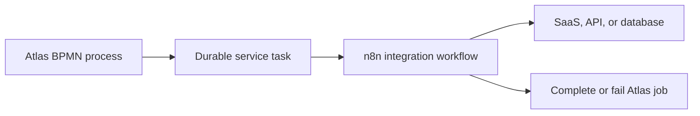

# n8n and Atlas

This document compares [n8n](https://n8n.io/) with Atlas. Both automate
work, but they solve different primary problems:

- **n8n** is an integration and technical workflow automation platform.
- **Atlas** is a durable BPMN 2.x workflow engine and process automation
  platform.

The products overlap at their edges, but they are generally complementary
rather than interchangeable.

> [!IMPORTANT]
> Atlas is in early development. Its APIs are unstable and it is not ready for
> production use. In this document, **implemented** means present in the current
> Atlas codebase and tests. **Target** means documented in the architecture or
> roadmap but not necessarily complete. n8n is an established product, and some
> of its governance and scaling capabilities depend on the selected edition.

## Executive summary

Choose **n8n** when the main problem is connecting applications, APIs, data,
files, or AI services quickly with ready-made integrations.

Choose **Atlas** when the main problem is executing a formal, long-lived BPMN
business process with durable state, explicit process semantics, deterministic
recovery, and auditable decisions.

A useful rule of thumb is:

> n8n puts the integration step at the centre. Atlas puts the business process
> state at the centre.

| Question | n8n | Atlas |
|---|---|---|
| Primary category | Integration and workflow automation | Durable BPMN workflow engine |
| Primary model | Proprietary node graph | BPMN 2.x process model |
| Main strength | Integration breadth and rapid implementation | Durable process semantics and recovery architecture |
| Typical user | Automation engineer, developer, power user | Process automation team, BPMN developer, platform team |
| Production maturity | Established cloud and self-hosted product | Early development; not production-ready |
| Standard process notation | No | BPMN 2.x |
| Long-running business processes | Possible, using execution and wait mechanisms | Core architectural use case |
| Human workflow | Forms and integration-oriented interaction | BPMN user tasks and task state |
| Decision modelling | Conditions, expressions, code, or external services | FEEL and DMN through the Atlas ecosystem |
| Ready-made integrations | Large catalogue | Limited; the Worker Type catalogue is the intended boundary |
| Runtime state model | Workflow executions backed by a database | Event log plus materialized state |
| Recovery principle | Product-level execution recovery and retry | Deterministic event replay through the same state-apply path |
| License | Sustainable Use License plus commercial offerings | Apache License 2.0 at the current pre-release stage |

## Product intent

### n8n

n8n is designed to make technical automation fast to assemble. A workflow
usually starts with a trigger and passes data through application, database,
HTTP, transformation, control-flow, and AI nodes. Its editor exposes the data
at each step, which makes integration development and debugging immediate.

Typical n8n workflows include:

- receiving a webhook and updating several SaaS applications;
- moving email attachments to document storage;
- synchronizing CRM and ERP records;
- transforming JSON or tabular data;
- generating reports and notifications;
- orchestrating AI models, agents, and vector stores;
- invoking custom JavaScript or Python for a local transformation.

### Atlas

Atlas is designed to execute business processes whose state must remain correct
across waits, failures, retries, and restarts. BPMN XML is compiled at deployment
time into an immutable, integer-indexed graph. At runtime, a single writer per
partition processes commands, emits facts as events, persists them, and
materializes state.

Typical Atlas processes include:

- an application with review, clarification, approval, and rejection paths;
- a multi-day or multi-week case with timers and messages;
- a process with user tasks, assignments, and an auditable task history;
- a process whose business decisions are expressed separately in DMN;
- orchestration of domain workers with explicit retry and incident semantics;
- a high-volume population of durable process instances.

## Modelling and semantics

An n8n canvas is an executable **integration graph**. Its nodes represent
triggers, actions, transformations, conditions, loops, merges, code, and
sub-workflows. The graph is highly effective for technical automation, but it
does not claim BPMN execution semantics.

An Atlas model is an executable **BPMN process model**. BPMN gives events,
activities, gateways, scopes, boundary events, subprocesses, call activities,
and multi-instance behaviour defined meanings. The notation can also provide a
shared artefact for business analysts, process owners, developers, and
operators.

| Requirement | Better fit | Why |
|---|---|---|
| Connect several APIs rapidly | n8n | Ready-made nodes, credentials, and data preview |
| Let a business audience read the process | Atlas | Standard BPMN notation and process concepts |
| Exchange models with BPMN tooling | Atlas | BPMN XML is the source artefact |
| Manipulate arbitrary JSON between calls | n8n | Expressions and code nodes are first-class |
| Model timers, messages, and boundary behaviour formally | Atlas | These are BPMN execution concepts |
| Debug one integration step interactively | n8n | Node-level test execution and data inspection |
| Separate decision logic from process flow | Atlas | FEEL and DMN are part of the intended model |

Atlas targets broad BPMN 2.0 coverage, but coverage is delivered incrementally.
The current implementation must always be checked against
[the roadmap](../../ROADMAP.md); the existence of a BPMN symbol in a modeller
does not imply that Atlas executes it yet.

## Execution and persistence

### n8n execution model

n8n persists workflows, credentials, and execution data in a database. It can
use SQLite in a default self-hosted setup and PostgreSQL for supported
production configurations. In queue mode, a main instance accepts triggers and
webhooks, Redis brokers execution jobs, and workers execute them against shared
storage.

This is a mature architecture for distributing integration work. The
performance and reliability of a workflow often depend more on external API
latency, rate limits, payload size, and third-party availability than on the
orchestrator itself.

See the official n8n documentation for
[database configuration](https://docs.n8n.io/hosting/configuration/supported-databases-settings/)
and [queue mode](https://docs.n8n.io/hosting/scaling/queue-mode/).

### Atlas execution model

Atlas uses the following safety-critical order:

```text
Command
  -> single-writer processor
  -> events
  -> WAL append and shared fsync
  -> state commit
  -> follow-up commands
  -> externally visible side effects
```

The key properties are:

- append-only write-ahead logging;
- group commit;
- one state writer per partition;
- deterministic replay;
- one `applyToState` path for live processing and recovery;
- Pebble-backed materialized state;
- events as persisted facts;
- no externally visible effect before durability.

These are project invariants, not optional implementation details. See
[Architecture](../ARCHITECTURE.md) and
[Invariants](../architecture/invariants.md).

| Property | n8n | Atlas |
|---|---|---|
| Primary persistence view | Stored workflow executions | Event log and materialized process state |
| Distributed execution | Main process, Redis queue, workers | Independent single-writer partitions |
| Durable event log as source of truth | Not the central abstraction | Yes |
| Deterministic replay as core contract | Not the central abstraction | Yes |
| Group commit as core design | No | Yes |
| Durable before visible invariant | No equivalent public core invariant | Yes |
| External work | Nodes perform integrations | Jobs/workers keep I/O outside the processor |

Atlas has the more specialized engine architecture. n8n has the much more
mature operational platform.

## Long-running processes

Both products can wait and continue later, but they expose different mental
models.

In n8n, operators primarily reason about workflow executions, nodes, input and
output data, retries, and failed executions. The
[Wait node](https://docs.n8n.io/integrations/builtin/core-nodes/n8n-nodes-base.wait/)
can suspend execution and resume it after time or an external event.

In Atlas, operators reason about process instances, element instances, jobs,
tasks, timers, messages, incidents, variables, and deployment versions. This is
a closer fit for a durable business case whose state remains meaningful for
weeks or months.

Atlas is therefore the stronger conceptual fit for long-running,
audit-sensitive BPMN processes. Today, however, n8n is the production-ready
choice while Atlas remains under development.

## Integrations and external work

Integration breadth is n8n's clearest advantage. It provides built-in and
community nodes, credential handling, HTTP requests, webhooks, database access,
file processing, code nodes, AI integrations, and reusable workflow templates.
See the official [integrations catalogue](https://n8n.io/integrations/).

Atlas deliberately keeps external I/O outside the single-writer processor.
Service tasks create durable jobs; workers perform side effects and submit job
completion or failure commands. Atlas can also expose APIs and worker
boundaries, but it does not currently offer a catalogue comparable to n8n.

| Use case | Better fit |
|---|---|
| Microsoft 365, CRM, messaging, and databases | n8n |
| Arbitrary REST API with minimal code | n8n |
| Broad catalogue of supported applications | n8n |
| Domain-specific worker controlled by BPMN state | Atlas |
| Durable service task with engine-managed lifecycle | Atlas |
| Central integration hub | n8n |
| Central BPMN orchestrator | Atlas |

Atlas should not make a broad n8n-style Worker Type catalogue a near-term goal.
That would expand the product surface substantially and compete with the more
important work on BPMN correctness, recovery, and operational safety.

## Human work

n8n can involve people through forms, messages, approval links, webhooks, and
external task systems. This is practical for lightweight interaction, but human
task management is not its primary process abstraction.

Atlas models human work as BPMN user tasks tied to a process instance. The
target platform model includes task creation, assignment, claiming, completion,
forms, candidate users or groups, deadlines, and process-variable updates.
Actual support for each capability must be verified against the current code
and roadmap.

For a notification followed by a callback, n8n is often sufficient. For a
shared worklist whose tasks have formal process context and an audit trail,
Atlas has the more appropriate domain model.

## Decisions, FEEL, and DMN

n8n commonly implements decisions with conditions, switch nodes, expressions,
code, data lookups, AI models, or an external decision service. This is flexible
but can distribute business rules across technical workflows.

Atlas is designed to separate process flow and decision logic:

- FEEL expressions are compiled outside the runtime hot path;
- BPMN gateways use compiled conditions;
- DMN decisions are provided through
  [Temis](https://github.com/pblumer/temis);
- decision results must be persisted as facts so recovery does not re-evaluate
  a potentially non-deterministic external decision.

| Decision concern | n8n | Atlas |
|---|---|---|
| Simple technical branch | Strong | Strong |
| Ad hoc decision in code | Strong | Not the primary model |
| Business-owned decision table | External/custom | DMN-oriented |
| FEEL semantics | Not a core standard | Core expression language |
| Deterministic replay of a decision result | Not a core principle | Required by the architecture |
| Decision audit trail | Workflow-specific | Part of the intended process model |

## Failure handling and recovery

n8n provides node error behaviour, retries, error workflows, stored failed
executions, and manual re-execution. These facilities are convenient when an
API call or transformation fails. See
[error handling](https://docs.n8n.io/flow-logic/error-handling/) and
[workflow settings](https://docs.n8n.io/workflows/settings/).

Atlas distinguishes commands, persisted events, materialized state, job
failures, retries, incidents, BPMN errors, termination, and crash recovery.
Changes to persistence or execution behaviour require recovery tests because
live state and replayed state must be identical.

The practical distinction is:

- n8n is currently better at interactively diagnosing and retrying a failed
  integration step;
- Atlas has the stronger formal model for reconstructing durable process state
  after a crash;
- Atlas still has to prove this architecture through production maturity and
  operating experience.

## Scaling and performance

n8n scales execution through queue mode and additional workers. Its real-world
throughput depends heavily on workflow composition and external services.

Atlas is optimized for engine throughput through:

- compiled integer-indexed process graphs;
- no XML parsing or expression compilation on the runtime hot path;
- allocation-conscious processor code;
- one writer per partition without regular process-state locks;
- command batching and one shared `fsync`;
- horizontal scaling through independent partitions.

These design choices give Atlas high performance potential, but they are not a
claim that Atlas already outperforms n8n in production. The systems execute
different workloads, and a meaningful benchmark must define model complexity,
durability settings, payload size, external I/O, hardware, and recovery
guarantees.

## Operations, security, and governance

| Capability | n8n | Atlas |
|---|---|---|
| Managed cloud | Available | Not available |
| Established self-hosting guidance | Yes | Developing |
| Distributed worker operation | Established queue mode | Partition and worker architecture under development |
| Upgrade and migration history | Mature | APIs and formats are still unstable |
| Enterprise identity and governance | Available depending on edition | Incomplete |
| Credential management | Product capability | Worker/secret boundary under development |
| Multi-tenant production hardening | Product and edition dependent | Must be completed and proven |
| Commercial support | Available | Community/project based |

For n8n, consult the current
[edition comparison](https://docs.n8n.io/hosting/community-edition-features/)
because features such as environments, external secrets, log streaming,
advanced collaboration, or SSO may require a paid edition.

A publicly exposed Atlas HTTP or MCP endpoint requires authentication,
authorization, TLS or a trusted reverse proxy, rate limiting, audit logging,
secret management, and tenant isolation. Availability of an endpoint alone
must never be interpreted as production hardening.

## User experience

n8n optimizes for fast technical construction and debugging: node search,
drag-and-drop editing, credentials, data preview, expressions, step testing,
execution history, and templates.

Atlas targets a broader process lifecycle:

- BPMN and DMN modelling;
- deployment and version visibility;
- user task worklists;
- process instance operations;
- incidents, variables, jobs, and decision evaluations;
- a live BPMN overlay for runtime state;
- operational and analytical views.

n8n is currently much more mature for developer ergonomics. Atlas can
differentiate through the quality of its process-instance view, live overlay,
incident handling, token visibility, and decision traces, but the UI must never
suggest execution support that the engine does not provide.

## Extensibility

| Area | n8n | Atlas |
|---|---|---|
| Main implementation language | TypeScript / Node.js | Go |
| Extension mechanism | Built-in, community, and custom nodes | Worker Types, workers, APIs, engine behaviours |
| Code inside workflows | JavaScript and Python options | Script tasks and external workers |
| Source model | n8n workflow JSON | BPMN XML and DMN artefacts |
| Embedding | Primarily operated as a platform | Engine core remains embeddable as a Go library |
| Native engine concern | Integration execution | Durable BPMN execution |

## License and strategic control

n8n is source-available under its
[Sustainable Use License](https://github.com/n8n-io/n8n/blob/master/LICENSE.md),
with commercial offerings for additional use cases and enterprise features. It
should not be treated as equivalent to a permissive open-source licence.

Atlas currently uses Apache License 2.0. It permits commercial use,
modification, distribution, and embedding subject to its licence and notice
requirements. The Atlas README still identifies the licence as a proposed
pre-release default, so it must be settled before the first release.

For an embedded engine or a product requiring broad redistribution rights,
Atlas offers greater licence freedom. That freedom also means the adopter
carries the development, maintenance, security, and operational risk of an
early-stage project.

## Decision guide

### Choose n8n when

- the automation must go to production now;
- integration breadth matters more than formal process semantics;
- the workflow mainly moves or transforms data between systems;
- low-code construction and interactive debugging are priorities;
- a managed cloud or established enterprise support model is required;
- BPMN model interchange is not a requirement.

### Choose Atlas when

- BPMN is the authoritative executable model;
- process state must remain explicit over long waits;
- deterministic recovery and a durable event history are core requirements;
- user tasks, incidents, timers, messages, and scopes need formal semantics;
- FEEL and DMN should be part of the process platform;
- the engine must be embedded in a Go product;
- accepting early-stage development risk is reasonable.

### Do not choose based on

- a visual canvas alone: both products draw connected steps, but the semantics
  differ;
- headline throughput without a workload and durability contract;
- planned Atlas features being mistaken for implemented capabilities;
- the word "workflow", which covers both integration flows and durable business
  processes.

## Complementary architecture

A strong combined architecture lets each product retain its responsibility:



Atlas owns the durable business process, its state, BPMN semantics, timers,
tasks, and decisions. n8n owns the technical integration with external systems.

The integration contract should include:

- the Atlas job key as an idempotency key;
- correlation between Atlas process instances and n8n executions;
- callback authentication and authorization;
- retry-safe completion and failure endpoints;
- no Atlas job completion before the external result is final;
- a clear distinction between technical failure and BPMN business error;
- secrets outside BPMN and workflow source artefacts;
- metrics and logs carrying both systems' correlation identifiers.

## Strategic recommendation for Atlas

Atlas should position itself as:

> The durable BPMN and decision orchestration layer for business-critical
> automation.

It should not position itself as a replacement for n8n's integration catalogue.
The priorities remain:

1. correctness and deterministic recovery;
2. BPMN semantics and conformance;
3. jobs, timers, messages, incidents, and human tasks;
4. FEEL and DMN consistency;
5. operational and security maturity;
6. clear Worker Type and worker contracts;
7. process operations and the live BPMN overlay;
8. selected high-value Worker Types only after the engine foundation is mature.

This positioning makes n8n a possible integration layer below Atlas rather than
a product Atlas must imitate.
