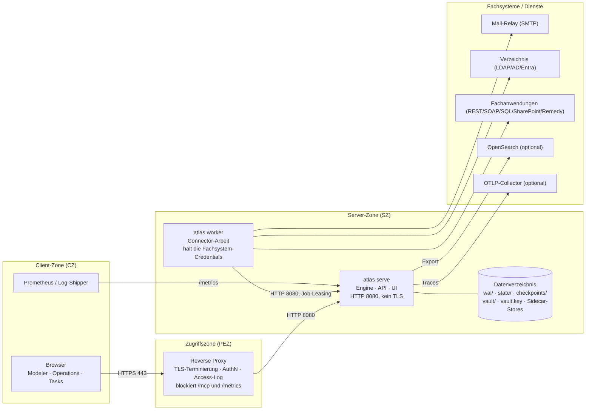

# ISDS-Konzept — Atlas BPMN Workflow Engine

> Antwortdokument zur Vorlage **P042-Hi01 — Informationssicherheits- und
> Datenschutzkonzept (ISDS-Konzept)**, BIT-Template V120 / NCSC-Template V4.4.
> Kapitelnummerierung und Reihenfolge folgen der Vorlage, damit der Inhalt
> direkt in das Word-Dokument übernommen werden kann.

| | |
|---|---|
| **Schutzobjekt** | Atlas — BPMN 2.x Workflow Engine (Fachanwendungsplattform) |
| **Klassifizierung** | intern |
| **Status** | in Arbeit (Entwurf des Herstellers/Projekts, noch nicht geprüft) |
| **Version** | 0.1 |
| **Datum** | 2026-08-25 |
| **Basis** | Atlas `0.x` Developer Preview, Stand `main` (siehe `atlas version`) |
| **Autor** | Atlas-Projektteam |

## Wie dieses Dokument zu lesen ist

Das ISDS-Konzept beschreibt immer ein **konkretes Informatikschutzobjekt in einer
konkreten Verwaltungseinheit** — nicht ein Produkt. Dieses Dokument liefert
deshalb zwei Sorten Inhalt, und die Unterscheidung ist wichtig:

- **Produktseitige Aussagen** — belegbar aus Code, Architekturentscheiden (ADR)
  und Betriebsdokumentation dieses Repositories. Sie sind verbindlich und werden
  mit Quelle zitiert (z. B. `docs/install.md`, `ADR-0044`). Diese Antworten
  müssen pro Einführung nicht neu erarbeitet werden.
- **Betriebs-/vorhabenseitige Aussagen** — hängen von der Verwaltungseinheit, den
  fachlichen Prozessen und der BIT-Umgebung ab. Sie sind mit **⟨…⟩** markiert und
  müssen vom Projekt (PL LB / AV / ISBO) ausgefüllt werden. Ohne diese Angaben
  ist das Konzept nicht genehmigungsfähig.

Ehrlichkeitsvorbehalt vorweg, weil er das ganze Dokument prägt: Atlas ist heute
ein **Developer Preview der `0.x`-Linie** und laut eigener Produktdokumentation
*nicht* für den Produktivbetrieb freigegeben (`README.md`, `SECURITY.md`,
`docs/install.md`). Ein ISDS-Konzept kann diesen Umstand nicht wegdefinieren; er
ist als Restrisiko **R-01** ausgewiesen und bestimmt die Empfehlung in Kapitel
2.3. Die technischen Aussagen in Kapitel 5 sind davon unabhängig korrekt.

Die produktseitigen Lücken, die vor einer Bundes-Einführung geschlossen werden
müssen, sind separat als Arbeitsliste geführt:
[`isds-offene-punkte.md`](isds-offene-punkte.md).

---

# 1 Generelle Anmerkungen

## 1.1 Beschreibung

Atlas ist eine **BPMN-2.x-Workflow-Engine**: eine Plattform, auf der fachliche
Geschäftsprozesse als BPMN-Modelle abgebildet, ausgeführt, überwacht und
nachvollzogen werden. Prozesse werden im Browser modelliert, auf dem Server
ausgeführt und jede Zustandsänderung wird als Ereignis in einem
Write-Ahead-Log (WAL) dauerhaft festgeschrieben.

Technisch ist Atlas **eine einzige, selbstenthaltene Binärdatei** (Go, statisch
gelinkt, `CGO_ENABLED=0`): Engine, HTTP-API, Web-UI (Modeler, Operations, Tasks,
Console) und der MCP-Adapter sind einkompiliert. Es gibt **keine Datenbank,
keinen Message-Broker und keine Laufzeitabhängigkeiten**; der gesamte
persistente Zustand liegt in einem Datenverzeichnis auf lokalem Datenträger
(`--data-dir`).

Schutzobjekt im Sinne dieses Konzepts ist die Installation als Ganzes:
Server-Prozess, Datenverzeichnis, optionale Worker-Prozesse, vorgelagerter
Reverse Proxy und die darauf betriebenen Fachprozesse.

⟨Fachlicher Einsatzzweck in der Verwaltungseinheit: welche Geschäftsprozesse,
welcher Benutzerkreis, welche Fachanwendungen werden angebunden.⟩

## 1.2 Zweck des Dokuments

Das ISDS-Konzept legt die nötigen Angaben zur Erhaltung und Verbesserung der
Informationssicherheit und des Datenschutzes fest. Es fasst die Aspekte der
Informationssicherheit und des Datenschutzes im Projekt zusammen. Für eine
korrekte Grundlage eines IKT-Vorhabens sind Artikel 6 Absatz 2 und Artikel 8 ISG
ein wesentlicher Bestandteil. Sämtliche Sicherheitsmassnahmen für die einzelnen
Informatikschutzobjekte müssen in aktueller Form dokumentiert werden (Artikel 16
Absatz 2 ISG); dazu dient unter anderem dieses ISDS-Konzept (Artikel 8 Absatz 1
ISV).

## 1.3 Gültigkeit des Dokuments

Die Gültigkeit eines ISDS-Konzepts beträgt maximal 5 Jahre.

**Zusätzliche Auflage für Atlas:** solange das Produkt in der `0.x`-Linie steht,
ändern sich On-Disk-Formate, API und Sicherheitsfunktionen zwischen Releases
(`docs/install.md`, `CHANGELOG.md`). Das Konzept ist deshalb **bei jedem
Minor-Release, mindestens aber jährlich** auf Aktualität zu prüfen, ebenso bei
jeder Änderung an Kapitel 5.4 (Kommunikationsmatrix) oder 6.4 (Massnahmen).

---

# 2 Management Summary

## 2.1 Allgemeines

Atlas führt Geschäftsprozesse aus. Damit fliessen **sämtliche Daten der
abgebildeten Geschäftsfälle** durch das System und werden dort dauerhaft
gespeichert — bei einem Personalprozess also Personendaten, bei einem
Beschaffungsprozess Vertragsdaten. Der Schutzbedarf des Systems ist deshalb
**der Schutzbedarf des am höchsten eingestuften Prozesses, der darauf läuft**
(vgl. Kapitel 4); eine Mandanten- oder Klassifizierungstrennung innerhalb einer
Installation bietet das Produkt heute nicht.

Zwei Eigenschaften der Architektur prägen das Sicherheitsbild positiv:

1. **Vollständige Nachvollziehbarkeit.** Zustand wird nie überschrieben. Jede
   Zustandsänderung ist ein Ereignis in einem anfüge-only-Log; der sichtbare
   Zustand ist dessen Faltung. Jede Instanz lässt sich Schritt für Schritt
   nachspielen, inklusive Variablenständen pro Schritt, gefallener
   DMN-Entscheide und Attribution externer Variablenänderungen auf den
   handelnden Benutzer (ADR-0001, ADR-0046, ADR-0048, ADR-0066, ADR-0098). Für
   die Anforderung «Nachvollziehbarkeit» ist das eine überdurchschnittlich
   starke Ausgangslage.
2. **Kleine Angriffsfläche im Kern.** Keine Datenbank, kein Broker, keine
   dynamischen Laufzeitabhängigkeiten, kein CGO, keine Telemetrie und keine
   Verbindung zum Hersteller. Credentials für Fremdsysteme liegen nicht im
   Prozessmodell, sondern in einem AES-256-GCM-verschlüsselten Vault bzw. beim
   Worker (ADR-0041, ADR-0069/0070, ADR-0168).

Dem stehen Lücken gegenüber, die für den Bund relevant sind und in Kapitel 6.1
als Restrisiken ausgewiesen sind: Produktreife (`0.x`), fehlende föderierte
Authentisierung (kein eIAM/OIDC — nur lokale Passwörter), grobgranulare
Autorisierung, keine Verschlüsselung ruhender Daten durch das Produkt selbst,
keine Hochverfügbarkeit und ein Löschkonzept, das der Anfüge-only-Natur des Logs
Rechnung tragen muss.

## 2.2 Zusammenfassung Restrisiken

Die vollständige Liste steht in Kapitel 6.1; die Bewertung erfolgt formell in der
Risikoanalyse P042-Hi02. Zusammenfassend verbleiben nach Umsetzung der
Massnahmen aus Kapitel 6.4 im Wesentlichen fünf Restrisiken:

| Nr. | Restrisiko | Bewertung (Vorschlag) |
|-----|------------|-----------------------|
| R-01 | **Produktreife**: `0.x` Developer Preview, instabile On-Disk-Formate, kein Downgrade, kein LTS, keine Backport-Patches | rot bis zur 1.0 |
| R-03 | **Keine föderierte Authentisierung**: lokale Passwörter statt eIAM; kein MFA, keine zentrale Passwort-Policy, kein automatischer Kontenentzug beim Austritt | gelb |
| R-04 | **Grobgranulare Autorisierung**: erzwungen wird nur die Rolle `admin` plus Projekt-Sichtbarkeit; jeder angemeldete Benutzer darf deployen, Instanzen starten und Laufzeitdaten inkl. Prozessvariablen lesen | gelb |
| R-05 | **Keine Verschlüsselung ruhender Daten** ausser Vault-Secrets: WAL, State-Store und Design-Time-Ablagen liegen im Klartext im Dateisystem | gelb, grün mit Datenträgerverschlüsselung |
| R-07 | **Keine Hochverfügbarkeit**: Single-Writer, genau ein Prozess pro Datenverzeichnis, keine Replikation (ADR-0175 ist erst *Proposed*) | gelb, abhängig von der Verfügbarkeitsanforderung |

Der Entscheid, ob diese Restrisiken in Kauf genommen werden, obliegt dem Leiter
der zuständigen Verwaltungseinheit. ⟨Entscheid dokumentieren.⟩

## 2.3 Abschliessende Bemerkungen

Empfehlung des Projektteams für eine Einführung im Bund:

1. **Einstieg mit Schutzbedarf «normal»** und Klassifizierung bis maximal
   **intern**. Prozesse mit besonders schützenswerten Personendaten,
   Klassifizierung «vertraulich» oder RINA-Relevanz erst nach Schliessen der
   Punkte R-03/R-04/R-05 und nach einem Penetrationstest.
2. **Reverse Proxy mit TLS und Authentisierung davor ist obligatorisch** — Atlas
   spricht ausschliesslich Klartext-HTTP (`docs/install.md`). `/mcp` und
   `/metrics` sind am Proxy zu sperren.
3. **Eine Installation pro Schutzbedarfsklasse**, nicht Mischbetrieb — solange es
   keine Mandantentrennung gibt, ist die Installationsgrenze die einzige
   verlässliche Trennlinie.
4. **Betriebsseitige Kompensationsmassnahmen** aus Kapitel 6.4 (Datenträger-
   verschlüsselung, Backup/Restore-Test, Monitoring auf die dokumentierten
   Log-Ereignisse, Rechte-Review) sind Voraussetzung, nicht Kür.
5. **Freigabe zeitlich befristen** und an das Erreichen der 1.0 bzw. an die
   Punkteliste in [`isds-offene-punkte.md`](isds-offene-punkte.md) knüpfen.

## 2.4 Ausnahmen und Portöffnungen

Aufzulisten mit Begründung und Referenz. Aus dem Produkt ergeben sich folgende
typische Anträge; welche davon tatsächlich nötig sind, hängt von den
angebundenen Fachsystemen ab (siehe Kommunikationsmatrix 5.4).

| Nr. | Art | Gegenstand | Begründung | Referenz |
|-----|-----|------------|------------|----------|
| A-01 | CRQ FW-Portöffnung | Reverse Proxy (PEZ/SZ) → Atlas-Server TCP 8080 | Zugriff der Benutzer auf UI und API | ⟨CRQ-Nr.⟩ |
| A-02 | CRQ FW-Portöffnung | Worker → Atlas-Server TCP 8080 | Job-Leasing der Connector-Arbeit (ADR-0007/0168) | ⟨CRQ-Nr.⟩ |
| A-03 | CRQ FW-Portöffnung | Worker → Fachsystem (SMTP 25/587, LDAP 389/636, SQL 1433/5432/3306, HTTPS 443) | ausgehende Connector-Aufrufe | ⟨CRQ-Nr., pro Ziel⟩ |
| A-04 | CRQ FW-Portöffnung | Atlas → OpenSearch (9200/443), OTLP-Collector (4318), Prometheus-Scrape | Export, Tracing, Monitoring | ⟨CRQ-Nr.⟩ |
| A-05 | Proxy-/SSL-Whitelist | ausgehend zu ⟨Fachsystem-Hosts⟩ | REST-/SOAP-/Graph-Connectoren | ⟨CRQ-Nr.⟩ |
| A-06 | Ausnahmebewilligung (P035) | Betrieb eines Produkts der `0.x`-Linie ohne Herstellersupportvertrag | R-01; Open Source, AGPL-3.0-only, Support über ⟨Regelung⟩ | ⟨Referenz⟩ |
| A-07 | Ausnahmebewilligung (P035) | Öffentlicher Start-Link aus dem Internet (falls genutzt, ADR-0029) | Publikumsintake ohne Konto | ⟨Referenz⟩ |
| A-08 | keine | Kein ausgehender Zugriff des Servers ins Internet erforderlich | Atlas prüft keine Updates, sendet keine Telemetrie | Code-Prüfung |

## 2.5 Genehmigung

Die Unterschriften zur Genehmigung und zur Akzeptanz der verbleibenden Risiken
müssen vor der Betriebsaufnahme geleistet werden. Mit seiner Unterschrift
bestätigt der ISBO, das ISDS-Konzept geprüft zu haben. Auftraggeber und
Geschäftsprozessverantwortlicher genehmigen mit ihrer Unterschrift das Konzept.
Der Leiter der zuständigen Verwaltungseinheit entscheidet, ob bekannte
Restrisiken in Kauf genommen werden können.

| Rolle | Datum / Name / Unterschrift |
|-------|------------------------------|
| ISBO | ⟨…⟩ |
| Auftraggeber | ⟨…⟩ |
| Geschäftsprozessverantwortlicher | ⟨…⟩ |
| Informationssicherheitsverantwortlicher | ⟨…⟩ |

---

# 3 Verzeichnis der sicherheitsrelevanten Dokumente

**Rechtliche Grundlagen** (aus der Vorlage übernommen, durch die
Verwaltungseinheit zu ergänzen — die Erhebung erfolgt mit dem Rechtsdienst):

| Dokumententyp | Titel |
|---------------|-------|
| Gesetz | SR 128 Informationssicherheitsgesetz (ISG) |
| | SR 235.1 Datenschutzgesetz (DSG) |
| | SR 152.1 Archivierungsgesetz (BGA) |
| | SR 172.019 Bundesgesetz über den Einsatz elektronischer Mittel zur Erfüllung von Behördenaufgaben (EMBAG) |
| | SR 172.010 Regierungs- und Verwaltungsorganisationsgesetz (RVOG) |
| Verordnung | SR 128.1 Informationssicherheitsverordnung (ISV) |
| | SR 235.11 Datenschutzverordnung (DSV) |
| | SR 172.010.58 Verordnung über die Koordination der digitalen Transformation und die IKT-Lenkung (VDTI) |
| | SR 172.010.442 Randdatenverordnung |
| Weisung | ⟨amts-/departementsspezifisch⟩ |
| Strategie | IKT-Strategie der Bundesverwaltung |
| Methode | HERMES |
| Übergeordnete Sicherheitskonzepte | ⟨IT-Grundschutzdokument BIT, Zonenkonzept, Betriebssicherheitskonzept⟩ |
| SLA | ⟨SLA BIT ↔ Verwaltungseinheit⟩ |

**Produktdokumentation Atlas** (Quelle der produktseitigen Aussagen):

| Dokument | Inhalt |
|----------|--------|
| `README.md` | Überblick, Funktionsumfang, Reifegrad |
| `SECURITY.md` | Sicherheitspolitik, Meldeweg für Schwachstellen (private vulnerability reporting), unterstützte Versionen |
| `docs/install.md` | Betriebshandbuch: Installation, systemd-Härtung, `--auth`, TLS-Vorgabe, Vault-Key, Backup, Upgrade, sämtliche Flags und Umgebungsvariablen, Log-Ereignisnamen |
| `docs/ARCHITECTURE.md`, `docs/architecture/*` | Architektur, Invarianten, Datenmodell, Prozessor, Compiler |
| `docs/adr/` | 180+ Architekturentscheide mit Begründung; die sicherheitsrelevanten sind unten je Kapitel zitiert |
| `deploy/README.md`, `deploy/helm/atlas` | Container-Image und Helm-Chart inkl. SecurityContext |
| `conformance/COVERAGE.md` | nachweisbare BPMN-Abdeckung inkl. Replay-Äquivalenz-Orakel |
| `LICENSE`, `THIRD_PARTY_NOTICES.md` | AGPL-3.0-only, Drittkomponenten |
| `CHANGELOG.md` | Änderungen je Release, inkl. Breaking Changes an Log-Ereignisnamen |

**Projektdokumente** (durch das Vorhaben zu erstellen): ⟨P041-Hi01
Schutzbedarfsanalyse, P042-Hi02 Risikoanalyse, P042-Hi03 Notfallkonzept,
Bearbeitungsreglement, Betriebshandbuch, Systemabnahmeprotokoll⟩.

---

# 4 Einstufung nach P041 - Schutzbedarfsanalyse

Die Einstufung erfolgt gemäss P041 (Schuban) und ist **vom Vorhaben
auszufüllen** — sie richtet sich nach den Geschäftsprozessen und Daten, nicht
nach dem Produkt.

| Grundwert | Einstufung | Begründung |
|-----------|-----------|------------|
| Verfügbarkeit | ⟨normal / erhöht / hoch⟩ | ⟨Wie lange darf der Prozess stillstehen? Bezug zu R-07: Atlas ist heute Single-Node.⟩ |
| Vertraulichkeit | ⟨normal / erhöht / hoch⟩ | ⟨Welche Klassifizierung haben die Prozessvariablen und Anhänge?⟩ |
| Integrität | ⟨normal / erhöht / hoch⟩ | ⟨Welche Folgen hat eine unbemerkte Verfälschung eines Geschäftsfalls?⟩ |
| Nachvollziehbarkeit | ⟨normal / erhöht / hoch⟩ | ⟨Beweisbedarf; Atlas liefert hier von Haus aus viel, siehe 2.1.⟩ |

Vier Hinweise, die die Einstufung produktseitig beeinflussen und deshalb hier
festgehalten sind:

1. **Keine Trennung innerhalb einer Installation.** Alle Prozesse einer
   Installation teilen ein Datenverzeichnis, ein Benutzerverzeichnis und dasselbe
   Autorisierungsmodell. Der höchste Schutzbedarf eines beliebigen darauf
   laufenden Prozesses bestimmt die Einstufung der ganzen Installation.
2. **Keine Klassifizierungsverarbeitung.** Atlas kennt keine
   Informationsklassifizierung, keine Kennzeichnung, keine daran gebundene
   Zugriffsregel. Für nach ISchV klassifizierte Informationen fehlen die
   Bearbeitungsvorschriften-Mechanismen; über «intern» hinausgehende
   Klassifizierungen bedürfen kompensierender Massnahmen und einer expliziten
   Bewilligung.
3. **Verfügbarkeit ist heute organisatorisch zu lösen** (Backup/Restore,
   VM-Ebene), nicht durch das Produkt (R-07).
4. **Finanzielle Folgen** von Sicherheitsbedürfnissen (z. B. HA-Infrastruktur,
   Pentest, zweite Umgebung) sind in der Schuban zu schätzen: ⟨…⟩

Das genehmigte Ergebnis der Schutzbedarfsanalyse ist hier abzubilden bzw. im
Anhang beizulegen: ⟨Verweis P041-Hi01⟩

---

# 5 Sicherheitsrelevante Systembeschreibung

## 5.1 Ansprechpartner / Verantwortlichkeiten

| Wer | Name |
|-----|------|
| Anwendungsverantwortlicher (AV/PO) | ⟨…⟩ |
| Cyberchampion | ⟨…⟩ |
| Inhaber der Daten | ⟨…⟩ |
| Systembetreiber LE | ⟨…⟩ |
| Projektleiter LB | ⟨…⟩ |
| Ansprechpartner beim LE | ⟨…⟩ |
| ISBD | ⟨…⟩ |
| ISBO | ⟨…⟩ |
| DSBO | ⟨…⟩ |
| Benutzerkreis | ⟨…⟩ |
| Hersteller / Maintainer | Open-Source-Projekt `pblumer/atlas`, Lizenz **AGPL-3.0-only**; Schwachstellenmeldung über GitHub Private Vulnerability Reporting (`SECURITY.md`) |
| Interne Produktverantwortung | ⟨wer im Bund pflegt Build, Release-Bezug und Patch-Stand⟩ |

**Hinweis zum Supportmodell:** es gibt keinen kommerziellen Herstellersupport und
keine LTS-Linie; Sicherheitskorrekturen erscheinen im jeweils nächsten Release
der `0.x`-Linie, nicht als Backport (`SECURITY.md`). Die Verwaltungseinheit muss
festlegen, wer Releases bezieht, prüft und einspielt (Massnahme M-14).

## 5.2 Beschreibung des Gesamtsystems

### 5.2.1 Komponenten

| Komponente | Funktion | Sicherheitsrelevanz |
|------------|----------|---------------------|
| **Engine** (Compiler, Prozessor, WAL, State-Store) | führt Prozessinstanzen aus; ein Schreiber pro Partition; Ereignisse werden angehängt, gruppenweise mit *einem* `fsync` dauerhaft gemacht, erst danach sichtbar | Integrität und Nachvollziehbarkeit der Geschäftsfälle; «durable before visible» ist eine erzwungene Invariante (ADR-0005) |
| **Design-Time-Ablagen** (Sidecar-Stores) | Entwürfe, Projekte, Formulare, Deployments, Releases, Benutzer, Gruppen, Connectoren, Einstellungen — je eine JSON-Datei, atomar geschrieben | enthalten Konfiguration und Benutzerkonten, nicht Geschäftsdaten |
| **HTTP-API** (`/api/v1/…`) | vollständige Steuerfläche, OpenAPI-spezifiziert; Explorer unter `/api/docs` (abschaltbar) | einziger Zugangsweg für UI, Worker und Agenten |
| **Web-UI** | Modeler, Operations (Live-Tokens, Replay), Tasks-Inbox, Console, Handbuch — im Binary eingebettet | zeigt Prozessvariablen und damit potenziell Personendaten |
| **Worker-Prozess** (`atlas worker`) | führt Connector-/Service-Task-Arbeit aus, least Jobs über die HTTP-API | hält die Credentials der Fachsysteme; läuft idealerweise in der Zone des Zielsystems (ADR-0164/0168) |
| **MCP-Adapter** (`atlas mcp`) | stellt die API als Model-Context-Protocol-Werkzeuge bereit (für KI-Agenten) | `/mcp` ist **transportseitig nicht authentisiert** (ADR-0016) — am Proxy sperren |
| **Vault** | AES-256-GCM-verschlüsselte Ablage der Connector-Secrets | Schlüssel `vault.key` (Mode 0600) oder extern via `ATLAS_VAULT_KEY(_FILE)` (ADR-0069/0070) |
| **Reverse Proxy** ⟨nginx/Apache BIT-Standard⟩ | TLS-Terminierung, Zugriffssteuerung, Access-Log, Rate-Limiting | **zwingend** — Atlas selbst kann kein TLS |

### 5.2.2 Authentisierung

- **Opt-in:** ohne `--auth` ist der Server vollständig offen (Einzelbenutzer-
  Modus). Für jeden Bundesbetrieb ist `--auth` **obligatorisch** (M-02).
- **Verfahren:** lokale Benutzernamen/Passwörter; Hash mit **bcrypt**
  (`bcrypt.DefaultCost`), Salt und Kostenfaktor im Digest. Mindestlänge 8 Zeichen
  — bewusst ein Minimum, **keine Passwort-Policy-Engine** (`api/auth.go`).
- **Session:** nach erfolgreichem Login ein Cookie `atlas_session` mit 32 Byte
  Zufall aus `crypto/rand`; `HttpOnly`, `SameSite=Lax`, `Secure` sobald die
  Verbindung TLS ist; Lebensdauer 12 Stunden. Sessions liegen **nur im
  Arbeitsspeicher** — ein Serverneustart meldet alle Benutzer ab (ADR-0044).
- **Bootstrap:** beim ersten Start mit `--auth` und leerem Benutzerspeicher wird
  genau ein Administrator angelegt (`ATLAS_ADMIN_USERNAME`/`_PASSWORD`); ohne
  gesetztes Passwort wird ein starkes generiert und **einmalig** geloggt
  (Ereignis `auth.admin_seeded`). Es gibt **keine fest eingebauten
  Standardzugangsdaten**.
- **Wiederherstellung:** `atlas reset-password --data-dir …` arbeitet direkt gegen
  das Datenverzeichnis, mit oder ohne laufenden Server.
- **Nicht vorhanden:** SSO/Föderation (eIAM, OIDC, SAML, LDAP-Login), MFA,
  Kontosperre nach Fehlversuchen, Passwortablauf, Wiederverwendungssperre. Die
  Datenmodell-Haken für externe Identitäten (`Source`, `ExternalID`) existieren,
  die Anbindung selbst nicht (R-03).
- **Login-Fehler** liefern eine einheitliche Meldung ohne Benutzer-Enumeration;
  deaktivierte Konten (`Disabled`) werden abgewiesen.

### 5.2.3 Autorisierung / Rollenkonzept

| Prinzipal | Herkunft | Rechte |
|-----------|----------|--------|
| Benutzer (Rolle `user`) | lokales Konto | alles, was nicht ausdrücklich admin-geschützt ist: Modelle deployen, Instanzen starten/abbrechen, Laufzeitdaten und Prozessvariablen lesen, Tasks bearbeiten |
| Benutzer (Rolle `admin`) | lokales Konto | zusätzlich Benutzer- und Gruppenverwaltung, Secrets, Connectoren, Einstellungen, Backup/Restore, Snapshots, Migration, Deploy-Tokens |
| Projektmitglied | Projekt-Sichtbarkeit `private`/`shared` mit Rollen `viewer`/`editor` (ADR-0071, Gruppen ADR-0180) | Zugriff auf die Design-Time-Artefakte des Projekts |
| `system:mcp` | interner Bearer-Token, nur prozessintern (ADR-0049) | wie ein Benutzer, **nie** admin |
| `deploy-agent` | Deploy-Token eines Peer-Servers (ADR-0129), SHA-256-gehasht abgelegt | fail-closed-Allowlist aus genau zwei Operationen (Bundle importieren, eigene Deployments lesen) |
| anonym | öffentliche Start-Links (ADR-0029), Selbstregistrierungs-Link (ADR-0126) | nur die freigegebene Startformular-Route, ratenbegrenzt |

**Wichtig für die Beurteilung:** ausser `admin` wird **keine Rolle erzwungen**.
Insbesondere ist `POST /api/v1/deployments` **nicht** admin-geschützt — jeder
angemeldete Benutzer kann ein Prozessmodell einspielen und damit auch
Skript-Tasks und Connector-Aufrufe zur Ausführung bringen (R-04, R-09). Trennung
von Entwicklungs-/Test-/Produktionsumgebung und ein enger Benutzerkreis auf der
Produktion sind deshalb Pflicht (M-05).

### 5.2.4 Nachvollziehbarkeit und Protokollierung

| Spur | Inhalt | Zugriff |
|------|--------|---------|
| Ereignis-Log (WAL) | jede Zustandsänderung jeder Instanz, unveränderlich, mit Zeitstempel und Position | Grundlage für Replay und Export |
| Instanz-Historie / Replay | Schritt-für-Schritt-Nachvollzug inkl. Variablen-Momentaufnahme je Schritt (ADR-0046/0048/0065) | UI, API |
| Variablen-Audit | jede externe Variablenänderung mit **handelndem Benutzernamen**, Zeit, Scope, Name, neuem Wert (ADR-0098) | `GET /api/v1/instances/{key}/variable-audit` |
| Task-/Entscheid-Historie | Claim/Assign/Complete, DMN-Auswertungen mit Eingaben, Ausgaben und gefallener Regel (ADR-0042/0066/0159) | UI, API |
| Anwendungslog | strukturierte Zeilen mit stabilen `event=`-Namen auf stderr, optional JSON; die letzten Zeilen zusätzlich über `GET /api/v1/logs` (flüchtig) | journald / Log-Shipper |
| Metriken | Prometheus-Exposition unter `/metrics` (ADR-0142) | Monitoring |
| Traces | OpenTelemetry/OTLP, nur `/api/v1`, ohne Query-String, standardmässig aus | Collector |

**Lücke:** Atlas schreibt **kein Zugriffs-/Sicherheits-Audit-Log** für
An-/Abmeldungen, Fehlanmeldungen und Administrationsaktionen, und keinen
HTTP-Access-Log. Diese Spur muss der Reverse Proxy liefern (M-06, R-13).

### 5.2.5 Datensicherung und Wartung

- **Backup:** das gesamte `--data-dir` ist als Einheit zu sichern; die Teile sind
  einzeln nicht konsistent. Sicher ist: Dienst stoppen → Verzeichnis archivieren →
  starten, oder ein atomarer Volume-Snapshot über das ganze Verzeichnis. Ein
  dateiweises Kopieren im laufenden Betrieb ist **nicht** zulässig
  (`docs/install.md`). `vault.key` separat sichern.
- **API-Backup (ADR-0107):** admin-geschützt, sichert eine ausdrückliche
  Allowlist von Design-Time-Ablagen; `users/` und `vault.key` sind bewusst
  **nicht** enthalten. Restore ist ein Overlay, kein Wipe; Deployments greifen
  erst nach Neustart.
- **Instanz-Snapshot (ADR-0109):** ganze Instanz exportieren und auf einem
  anderen Server wieder einspielen.
- **Checkpoints/Kompaktierung:** `--checkpoint-interval` (Standard 5 min)
  verkürzt den Replay beim Start; `--compact-wal` löscht abgedeckte
  WAL-Segmente (irreversibel, opt-in) — sicherheitsrelevant für das Löschkonzept,
  siehe 5.3.
- **Upgrade:** stoppen → sichern → Binary ersetzen → starten. **Downgrade wird
  nicht unterstützt**; im Fehlerfall Restore.
- **Fernwartung:** ⟨Regelung des LE; produktseitig kein Fernwartungszugang, keine
  Hersteller-Verbindung, keine Telemetrie, keine Update-Prüfung.⟩
- **SLA:** ⟨…⟩

## 5.3 Beschreibung der zu bearbeitenden Daten

### 5.3.1 Datenkategorien

| Kategorie | Inhalt | Ablage | Personendaten? |
|-----------|--------|--------|----------------|
| Prozessvariablen | fachliche Nutzdaten der Geschäftsfälle, JSON-strukturiert (ADR-0037) | WAL + State-Store | **Ja, prozessabhängig** — ⟨welche Kategorien, ob besonders schützenswert⟩ |
| Ereignis-/Historiendaten | jede Zustandsänderung, Element-Besuche, Variablen-Momentaufnahmen, Entscheid-Auswertungen | WAL + State-Store | ja, soweit Variablen betroffen |
| Aufgabendaten | Zuweisung, Claim, Fälligkeit, Bearbeiter, Formularinhalte | State-Store | ja (Bearbeiteridentität) |
| Benutzerkonten | Benutzername, E-Mail, Anzeigename, Rollen, Gruppen, bcrypt-Hash, `Disabled`, `Source`/`ExternalID` | `users/`, `groups/` | **ja** (Mitarbeitendendaten) |
| Audit-Spuren | handelnder Benutzername je externer Variablenänderung / Task-Abschluss | State-Store | ja |
| Design-Time-Artefakte | BPMN-/DMN-Modelle, Formulare, Projekte, Dokumentation | Sidecar-Stores | in der Regel nein (Modell ≠ Fall) |
| Secrets | Zugangsdaten zu Fachsystemen | `vault/` (AES-256-GCM) bzw. Worker-Konfiguration | nein |
| Betriebsdaten | Log-Zeilen, Metriken, Traces | stderr/journald, Prometheus, Collector | Randdaten i. S. v. SR 172.010.442 — Benutzername in Log-Ereignissen möglich; Client-IP wird nur zur Ratenbegrenzung verwendet, nicht protokolliert |

**Datenhaltung:** ausschliesslich lokal im Datenverzeichnis der Installation
(Dateisystem, kein externes DBMS). Kein Cloud-Dienst, kein Herstellerzugriff.
Zusätzliche Kopien entstehen nur, wenn der Betrieb sie einschaltet: OpenSearch-
Export (ADR-0114), Traces, Backups, Instanz-Snapshots, Applikations-Bundles.

### 5.3.2 Fragen der Vorlage zur Bearbeitung von Personendaten

| Frage | Antwort |
|-------|---------|
| Ist die Datensammlung beim EDÖB angemeldet? | Die Meldepflicht für Datensammlungen ist mit dem revidierten DSG (in Kraft seit 1.9.2023) entfallen. Stattdessen ist die Bearbeitung im **Verzeichnis der Bearbeitungstätigkeiten** nach Art. 12 DSG zu führen. ⟨Eintrag durch die Verwaltungseinheit; Verweis hier einfügen.⟩ |
| Ist ein Bearbeitungsreglement zu erstellen? | ⟨Ja, sofern besonders schützenswerte Personendaten automatisiert bearbeitet werden oder ein Profiling stattfindet (Art. 6 DSV). Bei den vorgesehenen Prozessen: …⟩ |
| Besteht eine gesetzliche Grundlage zur elektronischen Bearbeitung? | ⟨Grundlage je Fachprozess angeben; Erhebung mit dem Rechtsdienst.⟩ |
| Müssen die Daten dem Bundesarchiv elektronisch zur Verfügung gestellt werden? | ⟨Ja/Nein je Prozess. Produktseitig: Atlas hat **keine Archivierungsschnittstelle**. Export ist über die API, Instanz-Snapshots (ADR-0109) oder den OpenSearch-Export möglich; das Anbieten ans BAR ist organisatorisch zu lösen (M-16).⟩ |
| Klassifizierte Informationen (ISchV)? | ⟨Vorgesehen bis maximal «intern»; darüber siehe Kapitel 4, Punkt 2.⟩ |
| RINA-relevant? | ⟨Ja/Nein; falls ja, Verweis auf die entsprechende Dokumentation.⟩ |
| Datenschutz-Folgenabschätzung (Art. 22 DSG)? | ⟨Prüfen; bei hohem Risiko für die Persönlichkeit erforderlich.⟩ |

### 5.3.3 Löschung und Aufbewahrung — was das Produkt leistet und was nicht

Für das Datenschutzrecht ist die Anfüge-only-Architektur der wesentliche Punkt,
deshalb hier explizit:

- **Automatische Löschung abgeschlossener Instanzen** ist eingebaut:
  `--retention-max-age` bzw. je Prozessdefinition `atlas:historyTtl` löscht den
  **Zustandsdatensatz** einer beendeten Instanz endgültig (Hard Delete) —
  Historie, Variablen-Momentaufnahmen, Variablen-Audit, Entscheide, Datenobjekte
  (ADR-0115, ADR-0144). Es ist ein durables Ereignis, kein Flag.
- **Die Ereignisse selbst bleiben im WAL**, bis Segmente durch
  `--compact-wal` (setzt Checkpointing voraus, irreversibel) entfernt werden.
  Wer Löschung im Sinne von Art. 6 Abs. 4 DSG belegen können muss, muss
  **Checkpointing und Kompaktierung einschalten** und die Fristen aufeinander
  abstimmen (M-08).
- **Weitere Kopien** sind mitzudenken: OpenSearch-Indizes (eigene Retention
  konfigurieren), Backups (Aufbewahrungsfrist der Sicherungen), Instanz-Snapshots
  und Applikations-Bundles, sowie ⟨Log-Aufbewahrung des Reverse Proxy⟩.
- **Empfehlung an die Modellierung:** Personendaten möglichst als Referenz
  (Geschäftsfallnummer, Personalnummer) statt als Inhalt in Prozessvariablen
  führen; das verkleinert alle oben genannten Kopien gleichzeitig.
- **Benutzerkonten** werden nicht automatisch gelöscht; `Disabled` erhält den
  Audit-Bezug. Kontenlebenszyklus ist organisatorisch zu regeln (M-07).

## 5.4 Architekturskizze / Kommunikationsmatrix

### 5.4.1 Architekturskizze (Sollzustand für einen Bundesbetrieb)

Ohne Worker laufen die verbliebenen In-Process-Connectoren im Server-Prozess;
das ist der abgekündigte Weg (ADR-0164) und für den Bund nicht empfohlen, weil
die Credentials dann im Engine-Prozess liegen und ausgehende Verbindungen aus der
Server-Zone erfolgen.

### 5.4.2 Kommunikationsmatrix

Format analog zum Beiblatt der Vorlage; ⟨Zonen, IP-Adressen und CRQ-Nummern durch
das Vorhaben ergänzen⟩. Initiator ist immer die Quelle.

| Nr. | Quelle (Zone) | Ziel (Zone) | Protokoll / Port | Zweck | Verschlüsselung | Authentisierung |
|-----|---------------|-------------|------------------|-------|-----------------|-----------------|
| K-01 | Benutzer-Client ⟨CZ⟩ | Reverse Proxy ⟨PEZ⟩ | HTTPS / 443 | UI und API | TLS ⟨1.2+/1.3⟩ | Session-Cookie ⟨+ vorgelagerte AuthN⟩ |
| K-02 | Reverse Proxy ⟨PEZ⟩ | Atlas-Server ⟨SZ⟩ | HTTP / 8080 | Weiterleitung | **keine** — Produkt kann kein TLS | keine auf Transportebene |
| K-03 | Atlas-Server ⟨SZ⟩ | lokales Dateisystem | — | WAL, State, Vault, Sidecar-Stores | keine (Datenträgerverschlüsselung ⟨LUKS/BitLocker⟩) | Dateirechte 0750 / 0600, eigener Dienstbenutzer |
| K-04 | Worker ⟨Zone des Fachsystems⟩ | Atlas-Server ⟨SZ⟩ | HTTP / 8080 | Job-Leasing, Ergebnisrückgabe (ADR-0007) | ⟨über Proxy/TLS führen⟩ | ⟨Bearer/Proxy⟩ |
| K-05 | Worker | Mail-Relay | SMTP / 25 · 587 (bzw. Graph HTTPS 443) | ausgehende Benachrichtigungen (ADR-0079/0093) | ⟨STARTTLS/TLS⟩ | ⟨Relay-Regel / OAuth2⟩ |
| K-06 | Worker | LDAP / AD / Entra ID | LDAP 389 · LDAPS 636 · HTTPS 443 | Verzeichnis-Connectoren (ADR-0153/0154/0166/0172) | LDAPS/TLS empfohlen | Dienstkonto aus Vault/Worker |
| K-07 | Worker | Fachanwendung REST/SOAP | HTTPS / 443 | Service-Tasks (ADR-0067/0165), OAuth2 möglich (ADR-0152) | TLS (Systemtruststore) | Token/Basic/OAuth2 aus Vault |
| K-08 | Worker | Datenbank | TCP / 1433 · 5432 · 3306 | generischer SQL-Connector (ADR-0173) | ⟨TLS erzwingen⟩ | Dienstkonto aus Vault |
| K-09 | Worker | SharePoint / Remedy | HTTPS / 443 | Fach-Connectoren (ADR-0141/0106) | TLS | Dienstkonto aus Vault |
| K-10 | Atlas-Server | OpenSearch | HTTPS / 9200 · 443 | Ereignis-Export (ADR-0114), optional | TLS ⟨Cluster-Konfiguration⟩ | Basic Auth via Umgebungsvariablen |
| K-11 | Atlas-Server | OTLP-Collector | HTTP / 4318 | Traces, optional, standardmässig aus | ⟨TLS⟩ | ⟨Collector-Regel⟩ |
| K-12 | Monitoring | Atlas-Server | HTTP / 8080 `/metrics` | Prometheus-Scrape | keine | **keine** — am Proxy/FW einschränken |
| K-13 | Atlas-Server ↔ Peer-Atlas ⟨andere Umgebung⟩ | je nach Richtung | HTTPS / 443 | Applikations-Promotion zwischen Umgebungen (ADR-0129); nur falls genutzt | TLS, **Verifikation nicht abschaltbar** (kein «skip verify») | Deploy-Token (Bearer, als SHA-256-Hash abgelegt, fail-closed-Allowlist auf 2 Operationen); Zieladresse und Credential-Referenz sind admin-verwaltet |
| K-14 | KI-Agent / Werkzeug | Atlas-Server `/mcp` | HTTP / 8080 | MCP-Steuerung (ADR-0016) | keine | **keine** — standardmässig am Proxy sperren |
| K-15 | Internet ⟨optional⟩ | Reverse Proxy → `/public/forms/…` | HTTPS / 443 | öffentliche Start-Links (ADR-0029), Selbstregistrierung (ADR-0126) | TLS | anonym, Token-gebunden, ratenbegrenzt |
| K-16 | Atlas-Server | Skript-Interpreter (lokal) | Prozessaufruf | Skript-Tasks `pwsh`/`python3`/`node` (ADR-0047) | — | läuft als Dienstbenutzer — siehe R-09 |

**Nicht vorhanden:** ausgehende Verbindungen zum Hersteller, Update-Prüfungen,
Telemetrie, Lizenz-Calls. Der Server benötigt für den Betrieb **keinen
Internetzugang**.

## 5.5 Beschreibung der zugrundeliegenden Technik

| Bereich | Umsetzung |
|---------|-----------|
| Sprache / Build | Go 1.26, `CGO_ENABLED=0`, statisch gelinkt, `-trimpath`; keine dynamischen Bibliotheken (ADR-0010) |
| Plattformen | Linux (amd64/arm64/armv6), Windows Server (Binary, keine Windows-Container), macOS; Container-Image Debian bookworm-slim |
| Betriebssystem-Anforderungen | ein Dienstbenutzer ohne Privilegien, ein Datenverzeichnis auf **lokalem** Datenträger (kein NFS — die Durability hängt an `fsync`) |
| Speicher / Persistenz | eigenes segmentiertes WAL (Group-Commit, ein `fsync` pro Batch) + eingebetteter LSM-Store (Pebble) für den materialisierten Zustand; Sidecar-Stores als atomar geschriebene JSON-Dateien |
| Ressourcen | ab 1 CPU-Kern und einige hundert MB RAM; Engine ist Single-Writer — schnelle lokale Disk zählt mehr als viele Kerne |
| Netzwerk | genau ein HTTP-Listener (`--addr`, Standard `:8080`); **keine TLS-Unterstützung im Produkt** |
| Kryptografie | Passwörter: bcrypt · Vault: AES-256-GCM (`crypto/aes`, `crypto/cipher`), 96-Bit-Zufallsnonce je Wert, Schlüssel-Fingerprint `keyId` aus SHA-256 · Session-/Interntokens: 32 Byte aus `crypto/rand` · Deploy-Tokens: SHA-256-Hash gespeichert · ausgehendes TLS: Go-Standardbibliothek mit System-Truststore, **kein** `InsecureSkipVerify` im Code |
| Eingabehärtung | BPMN-Upload auf 4 MiB begrenzt, Restore-/Import-Uploads begrenzt; Go-XML-Parser verarbeitet keine externen Entitäten/DTDs (kein XXE) |
| Web-Härtung | UI eingebettet (keine CDN-Abhängigkeit); `X-Content-Type-Options: nosniff` und restriktive CSP auf hochgeladenen Inhalten (Logo, Prozessdokumentation); CSRF-Schutz über `SameSite=Lax` |
| Container | non-root `65532:65532`, `readOnlyRootFilesystem: true`, `allowPrivilegeEscalation: false`, alle Capabilities entfernt; Helm-Chart als **StatefulSet mit genau einer Replika** (mehr wäre Datenkorruption) |
| systemd-Härtung (dokumentiert) | `NoNewPrivileges`, `PrivateTmp`, `ProtectSystem=strict`, `ProtectHome`, `ReadWritePaths` nur auf das Datenverzeichnis |
| Bezug / Integrität | GitHub-Releases mit `SHA256SUMS`; **keine Signatur, kein SBOM** (R-11). Alternative: Build aus den Quellen in der Bundesumgebung |
| Drittkomponenten (Auswahl) | Pebble (Storage), `golang.org/x/crypto` (bcrypt), Prometheus-Client, OpenTelemetry, LDAP-/SQL-Treiber, FEEL- und DMN-Bibliothek des Projekts; vollständig in `go.mod` / `THIRD_PARTY_NOTICES.md` |
| Lizenz | AGPL-3.0-only — quelloffen; im Sinne von Art. 9 EMBAG offenlegungsfähig, Auflagen der AGPL bei Weitergabe/Betrieb beachten ⟨Prüfung Rechtsdienst⟩ |

---

# 6 Risikoanalyse und Schutzmassnahmen

Die formelle, bewertete Risikoanalyse ist in der zum Konzept gehörenden
Excel-Datei **P042-Hi02** zu führen (Eintrittswahrscheinlichkeit × Auswirkung,
Restrisikomatrix). Dieses Kapitel liefert die **produktseitig belegte
Risikoliste** als Eingang dafür sowie die Massnahmen, die aus dem Produkt selbst
folgen. Die Bewertungsspalte ist ein Vorschlag und in der Schuban/Risikoanalyse
zu bestätigen.

## 6.1 Restrisiken

| Nr. | Risiko / Gefährdung | Grundwert | Massnahmen (Kap. 6.4) | Restrisiko |
|-----|---------------------|-----------|------------------------|------------|
| R-01 | **Produktreife.** `0.x` Developer Preview: On-Disk-Format instabil, kein Downgrade, keine LTS-Linie, Sicherheitsfixes nur im nächsten Release, kein kommerzieller Support | alle | M-05, M-11, M-14, befristete Freigabe | **rot** bis 1.0; gelb bei unkritischem Einsatz mit Ausnahmebewilligung |
| R-02 | **Kein TLS im Produkt.** Server spricht ausschliesslich HTTP; bei fehlendem/fehlkonfiguriertem Proxy Klartext im Netz (Session-Cookie, Prozessvariablen) | Vertraulichkeit, Integrität | M-01, Konfigurationsprüfung in der Abnahme | gelb → **grün** bei korrektem Proxy |
| R-03 | **Keine föderierte Authentisierung.** Lokale Passwörter statt eIAM; kein MFA, keine Passwort-Policy über Mindestlänge 8 hinaus, keine Sperre nach Fehlversuchen, kein automatischer Entzug beim Austritt | Vertraulichkeit | M-01 (AuthN am Proxy), M-06, M-07, Brute-Force-Schutz am Proxy | **gelb** |
| R-04 | **Grobgranulare Autorisierung.** Nur `admin` erzwungen; jeder angemeldete Benutzer darf deployen, starten, abbrechen und Prozessvariablen aller Instanzen lesen | Vertraulichkeit, Integrität | M-05, M-07, enger Benutzerkreis, getrennte Installationen | **gelb** |
| R-05 | **Keine Verschlüsselung ruhender Daten** ausser Vault-Secrets; wer Dateisystemzugriff hat, liest alle Geschäftsdaten | Vertraulichkeit | M-04 (Datenträgerverschlüsselung, Dateirechte, minimaler Admin-Kreis) | gelb → **grün** mit M-04 |
| R-06 | **Löschung vs. Anfüge-only-Log.** Retention löscht den Zustandsdatensatz, Ereignisse verbleiben im WAL bis zur Kompaktierung; weitere Kopien in OpenSearch, Backups, Snapshots | Datenschutz (Art. 6 DSG) | M-08, Modellierungsrichtlinie «Referenz statt Inhalt» | **gelb**, grün bei konsistent konfigurierten Fristen |
| R-07 | **Keine Hochverfügbarkeit.** Single-Writer, genau ein Prozess pro Datenverzeichnis; Ausfall = Ausfall bis Restore/Neustart; Replikation erst geplant (ADR-0175, *Proposed*) | Verfügbarkeit | M-11, M-12, M-17, ⟨VM-/Storage-HA⟩ | **gelb**, abhängig von der Verfügbarkeitsanforderung |
| R-08 | **Unauthentisierte Endpunkte.** `/mcp` (volle Steuerfläche!), `/metrics`, `/healthz`, `/readyz`, öffentliche Start-Links | Vertraulichkeit, Integrität | M-01 (sperren), M-13 | grün bei gesperrtem `/mcp`; **rot**, falls `/mcp` erreichbar bleibt |
| R-09 | **Skript-Tasks führen Code aus.** PowerShell/Python/JavaScript laufen im Kontext des Dienstbenutzers; wer deployen darf, führt Code aus | Integrität, Vertraulichkeit | M-09 (nicht benötigte Sprachen abschalten), M-05, systemd-Härtung | **gelb** |
| R-10 | **Ausgehende Connector-Aufrufe.** Ein Prozessmodell adressiert Zielsysteme; falsch modelliert oder missbraucht = Datenabfluss | Vertraulichkeit | M-10 (Registrierung durch Betrieb, Worker in der Zielzone, FW-Whitelist), M-05 | **gelb** |
| R-11 | **Lieferkette.** Releases nur mit `SHA256SUMS`, ohne Signatur und ohne SBOM; CI ohne automatisierte Schwachstellenprüfung (kein `govulncheck`/SAST) | Integrität | M-14, Build aus Quellen, Abhängigkeits-Scan im Bund | **gelb** |
| R-12 | **Sessions nur im Speicher**, 12 h Gültigkeit, Abmeldung aller Benutzer bei Neustart; keine serverseitige Sitzungsübersicht | Verfügbarkeit (Komfort), Vertraulichkeit | M-01, M-12 | **grün** |
| R-13 | **Kein Sicherheits-Audit-Log** für An-/Abmeldungen, Fehlversuche und Administrationsaktionen; kein HTTP-Access-Log im Produkt | Nachvollziehbarkeit | M-06 (Proxy-Logs, ⟨SIEM⟩) | **gelb** → grün mit M-06 |
| R-14 | **KI-Funktionen.** Modeler-Copilot und Agent-Task rufen einen vom Betreiber registrierten Endpunkt auf; falsch konfiguriert fliessen Prozessdaten an einen externen Dienst | Vertraulichkeit | M-18 (nicht registrieren bzw. nur bundesinterne Endpunkte) | **grün** bei Nichtregistrierung |
| R-15 | **Selbstregistrierung / öffentliche Links.** Ein Registrierungs-Link kann beim Bootstrap aktiv sein; Anträge landen als Genehmigungsaufgabe, die Rolle vergibt erst der Admin | Vertraulichkeit | M-13 (bewusst konfigurieren oder abschalten) | **grün** bei bewusster Konfiguration |
| R-16 | **Datenverzeichnis doppelt geöffnet.** Zwei `atlas serve` auf demselben Verzeichnis korrumpieren es (z. B. durch versehentliche zweite Replika) | Integrität, Verfügbarkeit | Helm-Chart als StatefulSet mit 1 Replika, Betriebsanweisung, M-12 | **grün** bei eingehaltener Betriebsanweisung |

⟨Abbild der Restrisikomatrix aus P042-Hi02 hier einfügen.⟩

## 6.2 Besonders zu beachtende Punkte

- **Spezielle Konten und Credentials**
  - Bootstrap-Administrator: einmalig erzeugt; generiertes Passwort wird
    **einmal geloggt** (`auth.admin_seeded`) — Log nach der Einrichtung
    bereinigen, Passwort ändern, `ATLAS_ADMIN_PASSWORD` aus der
    Environment-Datei entfernen.
  - `system:mcp`: prozessinterner Dienstprinzipal, nie Admin, Token nie über
    einen Endpunkt abrufbar (ADR-0049).
  - Deploy-Tokens (`deploy-agent`): Maschinen-Credential eines Peer-Servers,
    fail-closed auf zwei Operationen begrenzt (ADR-0129); Bestand regelmässig
    prüfen und nicht mehr benötigte löschen.
  - Worker- und Connector-Dienstkonten in den Fachsystemen: Least Privilege,
    Rotation ⟨Frist⟩; die Werte liegen im Vault bzw. beim Worker, nie im Modell.
- **`--user-provisioning` (Standard: an):** freigegebene Prozesse des geschützten
  System-Projekts dürfen Atlas-Logins anlegen, Passwörter setzen und Konten
  deaktivieren (ADR-0122/0123). Bewusst entscheiden; wenn nicht benötigt, mit
  `--user-provisioning=false` abschalten.
- **`--docs` (Standard: an):** API-Explorer unter `/api/docs`; auf der Produktion
  abschalten.
- **`vault.key`:** ohne Schlüssel ist ein Datenverzeichnis nicht wiederherstellbar
  (die Secrets sind unlesbar). Getrennt vom Backup aufbewahren oder — besser —
  den Schlüssel per `ATLAS_VAULT_KEY_FILE` bereitstellen, dann schreibt Atlas ihn
  nie auf Disk.
- **Ein Prozess pro Datenverzeichnis** — gilt auch für Wartungsarbeiten,
  Restore-Versuche und Kopien.
- **Prozessvariablen sind sichtbar:** in Operations, im Replay, in den
  Variablen-Momentaufnahmen und im Export. Wer Zugriff auf die Laufzeitansicht
  hat, sieht Fachdaten — bei der Vergabe des Benutzerkreises berücksichtigen.
- **Upgrade ist eine Migration:** vorher Backup, kein Downgrade möglich.

## 6.3 Potenzielle sicherheitsrelevante Vorfälle

Die Anwendung führt ein Log wichtiger Ereignisse mit stabilen `event=`-Namen;
zusammen mit den Proxy-Logs und den fachlichen Audit-Spuren lassen sich folgende
Vorfälle erkennen. ⟨Auswertung durch CSIRT/CSO/ISBO BIT abstimmen; Nutzung der
BIT-Dienstleistung «Analyse/Monitoring» prüfen.⟩

| Nr. | Vorfall | Beschreibung / Kriterium | Quelle |
|-----|---------|--------------------------|--------|
| 01 | Unverhältnismässige Erweiterung der Zugriffsrechte | Konto erhält `admin` oder wird auffällig vielen Gruppen/Projekten zugeordnet | Benutzer-/Gruppen-Ablage, ⟨Rezertifizierung⟩ |
| 02 | Massen-Export | Aufruf des Backup-Endpunkts, viele Instanz-Snapshots oder auffällig viele Laufzeitabfragen in kurzer Zeit | Proxy-Access-Log |
| 03 | Unautorisiertes Deployment | Prozessmodell ausserhalb des Change-Verfahrens eingespielt, insbesondere mit Skript-Task oder neuem Connector-Ziel | Deployment-Historie, Proxy-Log |
| 04 | Wiederholte Fehlanmeldungen / Passwort-Raten | gehäufte `401` auf `/api/v1/auth/login` von einer Quelle | Proxy-Access-Log (Atlas protokolliert Logins nicht, R-13) |
| 05 | Zugriff auf `/mcp` von aussen | jeder Treffer auf `/mcp`, der nicht von der lokalen Adapter-Instanz stammt | Proxy-Log / Firewall |
| 06 | Auffällige Connector-Aktivität | Häufung von Incidents oder Job-Fehlern auf einem Connector; ungewöhnliche Zielhosts | Incident-Liste (ADR-0061), Firewall-Logs |
| 07 | Externe Änderung von Prozessvariablen | Variablen einer laufenden Instanz von aussen gesetzt — mit handelndem Benutzer attribuiert | Variablen-Audit (ADR-0098) |
| 08 | Vault-Schlüssel-Abweichung | Secrets lassen sich nicht mehr öffnen (`keyId`-Mismatch) → Schlüsseltausch oder Manipulation | Startup-/Fehlerlog |
| 09 | Verlust der Durability | `checkpoint.failed`, `wal_compaction.failed`, `readyz` meldet blockierten Partition-Writer | Log, Monitoring |
| 10 | Manipulation des Datenverzeichnisses | zweiter Serverprozess, unerwartete Dateiänderungen, Rechteänderungen | ⟨Dateiintegritätsüberwachung⟩ |

Sicherheitsrelevante Vorfälle können eine Neueinschätzung der Risikolage und
Massnahmen zur Folge haben; abgeleitete Massnahmen sind unter 6.4 nachzuführen
und die Risikoanalyse ist zu aktualisieren.

## 6.4 Fortlaufende Umsetzung der Schutzmassnahmen

Nachführung durch den Anwendungsverantwortlichen (AV/PO), regelmässige Abstimmung
mit dem ISBO BIT.

| Nr. | Massnahme | Verantwortlichkeit | Umsetzung / Nachweis |
|-----|-----------|--------------------|----------------------|
| M-01 | Reverse Proxy mit TLS vorschalten; `/mcp` und `/metrics` sperren; Rate-Limiting und ⟨vorgelagerte Authentisierung⟩ aktivieren | ⟨Betrieb LE⟩ | Proxy-Konfiguration, Abnahmeprotokoll |
| M-02 | `--auth` aktiv; Bootstrap-Passwort geändert und aus Konfiguration/Log entfernt | ⟨Betrieb LE⟩ | Konfigurationsprüfung |
| M-03 | Vault-Schlüssel über `ATLAS_VAULT_KEY_FILE` bereitstellen; getrennte Aufbewahrung; Wiederherstellungsverfahren dokumentiert | ⟨Betrieb LE⟩ | Betriebshandbuch |
| M-04 | Datenträgerverschlüsselung, Dateirechte (0750/0600), eigener Dienstbenutzer, systemd-Härtung bzw. Container-SecurityContext | ⟨Betrieb LE⟩ | Systemdokumentation |
| M-05 | Getrennte Umgebungen (DEV/TEST/PROD); Deploy-Berechtigung auf einen definierten Kreis; Change-Verfahren für Modelländerungen | ⟨AV + Betrieb⟩ | Berechtigungskonzept, Change-Records |
| M-06 | Access- und Sicherheitsprotokollierung am Proxy, Weiterleitung an ⟨Log-Plattform/SIEM⟩; Alarme auf `checkpoint.failed`, `wal_compaction.failed`, `exporter.tick_failed`, `command.failed`, `auth.admin_seeded` | ⟨Betrieb LE⟩ | Monitoring-Konfiguration |
| M-07 | Benutzer-/Berechtigungslebenszyklus: Eintritt, Mutation, Austritt (`Disabled`), jährliche Rezertifizierung | ⟨AV⟩ | Rezertifizierungsprotokoll (Kap. 8.3) |
| M-08 | Aufbewahrung/Löschung konfigurieren: `--retention-max-age` bzw. `atlas:historyTtl`, Checkpointing **und** `--compact-wal`, OpenSearch-Retention, Backup-Fristen, ⟨Proxy-Logfristen⟩ | ⟨AV + Betrieb⟩ | Konfiguration, Löschnachweis |
| M-09 | Nicht benötigte Skriptsprachen abschalten (`--powershell=false --python=false --javascript=false`); `--script-timeout` prüfen | ⟨Betrieb LE⟩ | Startparameter |
| M-10 | Connectoren und Secrets ausschliesslich durch den Betrieb registrieren; Worker in der Zone des Zielsystems betreiben; Firewall-Whitelist je Ziel | ⟨Betrieb LE⟩ | Kommunikationsmatrix 5.4, CRQs |
| M-11 | Datensicherung gemäss 5.2.5; **halbjährlicher Restore-Test** inkl. Vault-Schlüssel | ⟨Betrieb LE⟩ | Restore-Protokoll |
| M-12 | Monitoring von `/readyz`, Prometheus-Metriken, Plattenplatz des Datenverzeichnisses; Startup-Probe mit ausreichendem Zeitbudget (Replay!) | ⟨Betrieb LE⟩ | Monitoring |
| M-13 | Öffentliche Start-Links und Selbstregistrierung bewusst konfigurieren bzw. deaktivieren; `--docs=false` und `--user-provisioning=false`, wo nicht benötigt | ⟨AV⟩ | Konfigurationsprüfung |
| M-14 | Release-/Patch-Prozess: definierte Bezugsquelle, `SHA256SUMS` prüfen, `CHANGELOG` sichten, Test in ⟨Testumgebung⟩, Backup vor Upgrade | ⟨AV + Betrieb⟩ | Change-Records |
| M-15 | Webscan und Penetrationstest vor Produktivsetzung; Befunde nach Kapitel 8.3 nachführen | ⟨Projekt⟩ | Prüfprotokoll |
| M-16 | Archivierung: Anbieten der geschäftsrelevanten Daten ans BAR organisieren, Exportweg testen | ⟨AV⟩ | Archivierungskonzept |
| M-17 | Notfallkonzept P042-Hi03 erstellen, Verweis auf BCM Stufe Amt | ⟨Projekt⟩ | Notfallkonzept |
| M-18 | Keine externen KI-Agenten-Endpunkte registrieren; falls doch, nur bundesinterne mit eigener Beurteilung | ⟨AV⟩ | Connector-Liste |
| M-19 | Klassifizierungsgrenze «intern» einhalten; keine Mischung von Schutzbedarfsklassen in einer Installation | ⟨AV + ISBO⟩ | Betriebsanweisung |

---

# 7 Wiederherstellung des Geschäftsbetriebes

Unterstützt das Schutzobjekt kritische Geschäftsprozesse, ist ein Notfallkonzept
nach **P042-Hi03** zu erstellen (M-17). In jedem Fall ist auf die BCM-Dokumente
auf Stufe Amt zu verweisen: ⟨Verweis⟩

**Produktseitige Ausgangslage:**

| Grösse | Aussage |
|--------|---------|
| Wiederanlauf nach Absturz | automatisch: beim Start wird das WAL ab dem neuesten Checkpoint nachgespielt; der Listener öffnet erst, wenn die Wiederherstellung abgeschlossen ist. `checkpoint-interval` (Standard 5 min) bestimmt, wie viel Log nachgespielt wird — ohne Checkpointing ab Beginn |
| Datenverlust bei Absturz (RPO) | **null für bestätigte Arbeit**: nichts wird sichtbar, bevor es auf der Platte liegt («durable before visible», ADR-0005). Verloren gehen können nur Anfragen, die noch keine Antwort erhalten haben |
| Datenverlust bei Verlust des Datenträgers (RPO) | = Alter der letzten Sicherung → ⟨Sicherungsintervall festlegen⟩ |
| Wiederanlaufzeit (RTO) | = Bereitstellung Server + Restore des Datenverzeichnisses (inkl. `vault.key`) + Replay. **Kein automatisches Failover** — ein zweiter Knoten darf nicht parallel auf dieselben Daten zugreifen (R-07/R-16) |
| Teilausfälle | ein fehlender Skript-Interpreter oder ein nicht erreichbares Fachsystem hält die betroffenen Aufgaben an (Jobs/Incidents), ohne den Rest zu stoppen; Job-Leases laufen ab und werden neu angeboten |

**Wiederherstellungsablauf (Empfehlung):** Dienst stoppen → Datenverzeichnis aus
der Sicherung zurückspielen → `vault.key` bereitstellen → Dienst starten →
`/readyz` abwarten → Stichproben: laufende Instanzen, Aufgabenliste, ein
Connector-Testaufruf. ⟨Als Ablauf im Notfallkonzept dokumentieren und im
Restore-Test (M-11) bestätigen.⟩

---

# 8 Einhaltung / Überprüfung / Abnahme der Schutzmassnahmen

## 8.1 Systemabnahmeprüfung

Vor der Produktivschaltung ist die Anwendung mit geeigneten Werkzeugen auf
Sicherheitslücken und Manipulierbarkeit zu testen und ein Protokoll zu führen;
Protokoll und Resultate sind dem ISBO des BIT unaufgefordert zuzustellen. Tests
und allfällige Korrekturmassnahmen sind vor dem Einführungsdatum vollständig
abzuschliessen. Verantwortlich für die Umsetzung der Sicherheitsmassnahmen sind
der Anwendungsverantwortliche und der Inhaber der Datensammlungen in Abstimmung
mit dem ISBO.

Die Schutzmassnahmen werden wie folgt gesichert:

- Neue Funktionen werden gegen bestehende Architektur, Schuban, IT-Grundschutz und
  dieses ISDS-Konzept verifiziert (Anforderungsassessment).
- Spezifikation und Abnahme durch die Verwaltungseinheit.
- Staging über die Umgebungsarchitektur mit Qualitätschecks.
- Regelmässiger Sicherheitscheck, Wissenstransfer an die Betriebsorganisation,
  Abnahmetestprotokoll und Go-Live durch den Betrieb BIT, Produktivsetzung über
  das Change-Management.

**Was das Produkt an Nachweisen mitbringt** (Qualitätssicherung, kein Ersatz für
den Sicherheitstest):

| Nachweis | Inhalt |
|----------|--------|
| CI-Pipeline | `go build`, `go vet`, `gofmt`, **`go test -race`**, Coverage-Untergrenze 95 % repositoryweit, Benchmark-Smoke, Browser-E2E-Tests |
| Konformitätssuite | registrierte BPMN-Merkmale und Workflow-Muster mit Abdeckungsbericht, fünf unabhängige Orakel, darunter **Replay-Äquivalenz** auf jedem Modell und ein optionaler Differenztest gegen eine fremde Engine |
| Wiederherstellungstests | «Zustand nach Replay == live aufgebauter Zustand» ist verpflichtender Testgegenstand für alles, was Ereignisse schreibt |
| Architekturentscheide | jede sicherheitsrelevante Entscheidung als ADR mit Begründung und Konsequenzen |

**Was das Vorhaben zusätzlich erbringen muss:** Webscan, Penetrationstest der
Gesamtinstallation (inkl. Proxy und Konfiguration), Konfigurationsprüfung gegen
Kapitel 6.4, Restore-Test, Prüfung der Kommunikationsmatrix gegen die
tatsächlichen Firewall-Regeln.

## 8.2 Zugriff auf bewirtschaftete Daten

Auf die bewirtschafteten Daten über die Mitarbeitenden des BIT wie auch der
Verwaltungseinheiten (intern und extern) kann gestützt auf Art. 2 Abs. 1 Bst. b
der Randdatenverordnung (SR 172.010.442) nur das CSIRT, der CSO und der ISBO des
BIT zugreifen. Benötigen andere Organisationseinheiten Zugriff, ist zwingend das
Einverständnis der Amtsleitung des BIT einzuholen; vorgängig sind ISBO und DSBO
anzuhören.

**Technische Ergänzung:** Zugriff auf Fach- und Randdaten dieser Installation
haben faktisch (a) angemeldete Benutzer über UI/API im Rahmen von Kapitel 5.2.3,
(b) Administratoren für Benutzer-, Connector- und Backup-Funktionen, (c) **jede
Person mit Dateisystemzugriff auf das Datenverzeichnis**, da die Daten ausser den
Vault-Secrets unverschlüsselt abgelegt sind (R-05). Der Kreis unter (c) ist zu
benennen und zu begrenzen: ⟨…⟩

## 8.3 Interne & Externe Kontrollen/Audits

⟨Laufend zu pflegen. Vorschlag für die Periodizität:⟩

| Prüfung | Rhythmus | Verantwortlich |
|---------|----------|----------------|
| Rezertifizierung Benutzer und Berechtigungen (inkl. Deploy-Tokens, Connector-Konten) | jährlich | ⟨AV⟩ |
| Restore-Test inkl. Vault-Schlüssel | halbjährlich | ⟨Betrieb⟩ |
| Webscan | bei jedem Major-/Minor-Upgrade | ⟨Betrieb⟩ |
| Penetrationstest | vor Produktivsetzung, danach alle ⟨3⟩ Jahre | ⟨Projekt/Betrieb⟩ |
| Prüfung Konfiguration gegen Kapitel 6.4 | jährlich und nach jedem Upgrade | ⟨AV + ISBO⟩ |
| Review dieses ISDS-Konzepts | jährlich (siehe 1.3) | ⟨AV + ISBO⟩ |

| Datum | Prüfung | Resultat | Bemerkungen |
|-------|---------|----------|-------------|
| ⟨…⟩ | ⟨…⟩ | ⟨…⟩ | ⟨Befunde in Kapitel 6.4 als Massnahme nachführen; Risikoanalyse aktualisieren⟩ |

## 8.4 Normative Prüfungen

| Datum | Prüfung | Resultat | Bemerkungen |
|-------|---------|----------|-------------|
| ⟨…⟩ | PI-Check | ⟨…⟩ | ⟨Ablage⟩ |
| ⟨…⟩ | SKP | ⟨…⟩ | ⟨Ablage⟩ |
| ⟨…⟩ | Health-Check | ⟨…⟩ | ⟨Ablage⟩ |

Massnahmen aus diesen Prüfungen sind unter Kapitel 6.4 nachzuführen.

---

# 9 Ausserbetriebnahme

Für die Liquidation wird der Standardprozess für Ausserbetriebnahmen von
Fachanwendungen mit der Kündigung des SLA ausgelöst (Anwendungskomponenten,
Server, Clientinstallationen, Löschung von Berechtigungen und Service-Usern,
Freigabe technischer Infrastrukturen, IP- und FW-Einträge).

Mindestens zu beachten, produktspezifisch konkretisiert:

1. **Archivierung:** alle geschäftsrelevanten Informationen sind dem Bundesarchiv
   nach BGA/Archivverordnung anzubieten. Exportwege: HTTP-API, Instanz-Snapshots
   (ADR-0109), Applikations-/Design-Time-Backup (ADR-0107), OpenSearch-Export.
   ⟨Format und Übergabe mit dem BAR abstimmen — vor dem Abschalten.⟩
2. **Datenträger löschen:** Datenverzeichnis (`wal/`, `state/`, `checkpoints/`,
   `vault/`, Sidecar-Stores), **`vault.key`**, alle Sicherungskopien,
   OpenSearch-Indizes, Instanz-Snapshots, exportierte Bundles, Log-Ablagen des
   Proxy — Vernichtung gemäss ISchV bzw. DSG/DSV für besonders schützenswerte
   Personendaten.
3. **Identitäten deprovisionieren:** Atlas-Benutzerkonten, Deploy-Tokens,
   Dienstkonten in den Fachsystemen (Mail-Relay, Verzeichnis, Datenbanken,
   SharePoint …), OAuth2-Registrierungen.
4. **Netzwerk zurückbauen:** Portöffnungen (Kap. 2.4), DNS-Einträge,
   Proxy-Ausnahmen, Schnittstellen zu anderen Anwendungen, öffentliche
   Start-Links widerrufen.
5. **Komponenten entfernen:** Worker-Installationen, Skript-Interpreter,
   Container-Images/Helm-Release; Deinstallation gemäss `docs/install.md`.
6. **Nachweis:** Ausserbetriebnahme-Protokoll mit Löschbestätigungen. ⟨…⟩

---

# 10 Abkürzungen

| Begriff / Abkürzung | Bedeutung |
|---------------------|-----------|
| ADR | Architecture Decision Record — Architekturentscheid mit Begründung (`docs/adr/`) |
| AV | Anwendungsverantwortlicher |
| BPMN | Business Process Model and Notation |
| DMN | Decision Model and Notation (Entscheidungstabellen) |
| DSBO | Datenschutzberater der Verwaltungseinheit |
| DSG / DSV | Bundesgesetz / Verordnung über den Datenschutz |
| EDÖB | Eidgenössischer Datenschutz- und Öffentlichkeitsbeauftragter |
| EMBAG | Bundesgesetz über den Einsatz elektronischer Mittel zur Erfüllung von Behördenaufgaben |
| FEEL | Friendly Enough Expression Language (Ausdruckssprache in BPMN/DMN) |
| ISBD / ISBO | Informationssicherheitsbeauftragter des Departements / der Organisationseinheit |
| ISDS-Konzept | Informationssicherheits- und Datenschutzkonzept |
| ISG / ISV | Informationssicherheitsgesetz / -verordnung |
| ISchV | Informationsschutzverordnung |
| LSM | Log-Structured Merge-Tree (Struktur des eingebetteten Zustandsspeichers) |
| MCP | Model Context Protocol — Werkzeugschnittstelle für KI-Agenten |
| OTLP | OpenTelemetry Protocol (Traces) |
| PL | Projektleiter |
| RINA | Risikomanagementmethode zur Reduktion nachrichtendienstlicher Ausspähung |
| RPO / RTO | Recovery Point / Recovery Time Objective |
| Schuban | Schutzbedarfsanalyse (P041) |
| SLA | Service Level Agreement |
| SV | Systemverantwortlicher |
| WAL | Write-Ahead Log — das anfüge-only-Ereignisprotokoll, Quelle der Wahrheit |

---

# 11 Anhang

Beizulegen bzw. zu verweisen:

- **P041-Hi01 — Schutzbedarfsanalyse**: ⟨Verweis/Beilage⟩
- **P042-Hi02 — Risikoanalyse** (Excel, mit Restrisikomatrix): ⟨Verweis/Beilage⟩
- **P042-Hi03 — Notfallkonzept**: ⟨Verweis/Beilage⟩
- **Kommunikationsmatrix** (Beiblatt der Vorlage), gefüllt aus Kapitel 5.4:
  ⟨Verweis/Beilage⟩
- **Offene produktseitige Punkte**: [`isds-offene-punkte.md`](isds-offene-punkte.md)
- Produktdokumentation gemäss Kapitel 3.
