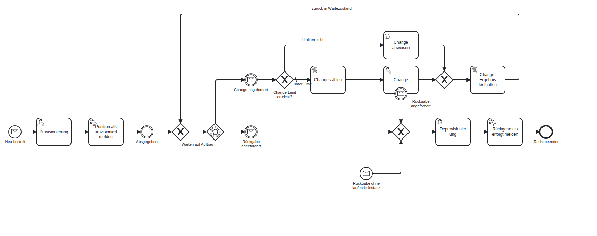

# Lebenszyklus als ein Strang pro Position — Vorlage

Entwurfsmodell zum ADR-Entwurf
[`draft-a-product-lifecycle-may-run-as-one-instance-per-position.md`](../../adr/draft-a-product-lifecycle-may-run-as-one-instance-per-position.md)
(Form `per-position`). Es ist **nicht** lauffähig im Katalog: Solange der Entwurf nicht
umgesetzt ist, kann ein Produkt eine Operation nur an ein Startereignis binden
(ADR-0425), und das Zwischenereignis «Rückgabe angefordert» wird von keiner Rückgabe
erreicht.

| Datei | Inhalt |
| --- | --- |
| [`proc_produkt_lebenszyklus_vorlage.bpmn`](proc_produkt_lebenszyklus_vorlage.bpmn) | Das Modell mit Diagramm; kompiliert in Atlas (20 Elemente, 2 Startereignisse). |
| [`proc_produkt_lebenszyklus_vorlage.png`](proc_produkt_lebenszyklus_vorlage.png) | Das gerenderte Diagramm. |

## Ablauf

Neu bestellt → Provisionierung → Ausgegeben → Warten auf Auftrag → (Change)* →
Deprovisionierung → Recht beendet.

## Stopps gegen Endlosschleifen

1. Jede Runde der Change-Schleife beginnt am ereignisbasierten Gateway und braucht ein
   externes Ereignis. Eine Schleife ohne Wartezustand stoppt die Engine ohnehin über das
   Execution Budget (ADR-0272).
2. Change-Limit: ab `maxChanges` (Standard 20) wird jeder weitere Change abgewiesen statt
   ausgeführt.
3. Eine Rückgabe während eines Changes bricht den Change ab (unterbrechendes
   Randereignis) und geht nicht verloren.
4. Eine Rückgabe ohne laufende Instanz (übernommene, alte oder abgebrochene Rechte) tritt
   über das Startereignis mit derselben Nachricht direkt in die Deprovisionierung ein.

Bewusst nicht im Modell: das Ende der Laufzeit (ADR-0344 gibt die Bestellzeile zurück)
und die Stornierung vor der Ausgabe (die Bestellung bricht die Instanz ab, ADR-0416).

## Nachrichten

| Nachricht | Verwendet von | Korrelation |
| --- | --- | --- |
| `produkt.provision` | Startereignis «Neu bestellt» | — |
| `produkt.change` | Zwischenereignis «Change angefordert» | `orderId + "/" + positionId` |
| `produkt.deprovision` | Zwischenereignis und Randereignis «Rückgabe angefordert», Startereignis «Rückgabe ohne laufende Instanz» | `orderId + "/" + positionId` |

Für ein konkretes Produkt werden Prozess-Id und Nachrichtennamen ersetzt, etwa
`laptop-huelle-14.provision`.

## Ungeprüft

- Das Modell ist kompiliert, aber nicht ausgeführt. Ob der Ausdruck für das Change-Limit
  wie vorgesehen ausgewertet wird, ist nicht getestet.
- `maxChanges` ist heute keine Startvariable; ohne sie gilt der Standard 20.
- Die Schritte «Provisionierung», «Change» und «Deprovisionierung» sind Platzhalter
  ohne Formular und ohne Kandidatengruppe.
